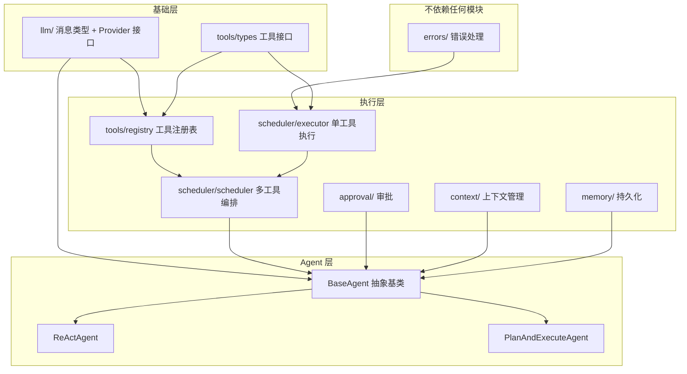

# 1. 框架全貌

## Agent 是什么？一个类比

想象一个**实习生**刚入职你的团队：

- 他很聪明（LLM），能理解你的指令，也能写出有条理的分析
- 但他不能直接查数据库、不能部署代码、不能发邮件 — 他需要**工具**
- 你给他一组工具（查日志、读代码、搜文档），他就能自己规划怎么用这些工具来完成任务
- 他的工作方式是：**想一想** → **用工具做一步** → **看结果** → **再想想下一步** → ... → **给出最终答案**

这就是 **ReAct 模式**（Reasoning + Acting），也是 t-agent 的核心循环。

t-agent 就是管理这个实习生工作流程的框架：
- 你负责提供 LLM（大脑）和 Tool（工具）
- 框架负责编排循环、传递消息、处理错误、流式输出

## 三层架构

```
┌───────────────────────────────────────────────┐
│  SDK 层 — 给开发者用的高层 API                    │
│  "打包好的工具箱，拿来即用"                         │
│  Extension(能力包)  Skill(任务配方)  SubAgent(子代理) │
├───────────────────────────────────────────────┤
│  Core 层 — 框架引擎                              │
│  "发动机，驱动 Agent 运转"                         │
│  Agent 循环 / 工具系统 / 事件流 / 状态机             │
├───────────────────────────────────────────────┤
│  Provider 层 — LLM 适配器                        │
│  "翻译官，让不同 LLM 说统一语言"                     │
│  OpenAI / Anthropic / Gemini                    │
└───────────────────────────────────────────────┘
```

**为什么分三层？**

- **Core 不关心你用哪个 LLM** — 换模型只需换 Provider，Agent 逻辑不变
- **Provider 不关心 Agent 怎么循环** — 它只负责"发消息、收流式响应"
- **SDK 不关心底层细节** — 开发者用 `Extension` 打包能力、用 `SubAgent` 做委派，不需要手写循环

这种分层让每一层可以独立演进。比如明天出了个新 LLM 厂商，你只需要写一个 Provider 适配器，Core 和 SDK 完全不动。

## 六个核心概念

### 概念 1：LLMProvider + ChatSession — "打电话"

```
LLMProvider（电话公司）
  │
  └─ .chat(options) → ChatSession（一通电话）
                         │
                         └─ .sendMessage(messages) → 流式响应
```

**Provider 是工厂，ChatSession 是产品。**

- Provider 像电话公司 — 它本身不通话，但能帮你接通
- 每次调 `.chat()` 就是拨通一个新电话（创建一个 Session）
- Session 带着固定配置（用哪个模型、什么系统提示词、哪些工具可用）
- 之后每次 `.sendMessage()` 就是在这通电话里说话

为什么不直接一个函数搞定？因为 **一个 Provider 可以创建多个 Session**：主 Agent 用 gpt-4o，SubAgent 用 gpt-4o-mini — 共享同一个 Provider（同一个 API Key），但各自有独立的 Session 配置。

### 概念 2：Tool — "Agent 的手"

LLM 只能"想"和"说"，Tool 让它能"做"。

```typescript
const searchLog = tool(
  {
    name: 'search_log',
    description: '在日志系统中搜索错误日志',
    parameters: z.object({
      keyword: z.string().describe('搜索关键词'),
      timeRange: z.string().describe('时间范围，如 "1h", "24h"'),
    }),
    tags: ['readonly'],  // 标记为只读，审批系统会用到
  },
  async ({ keyword, timeRange }) => {
    const logs = await logService.search(keyword, timeRange);
    return { content: JSON.stringify(logs) };
  }
);
```

**一个 Tool 有四个要素：**

| 要素 | 作用 | 给谁用 |
|------|------|--------|
| `name` + `description` | LLM 通过描述判断什么时候该调这个工具 | LLM |
| `parameters` (Zod schema) | 定义参数格式，自动转成 JSON Schema 给 LLM，也做运行时验证 | LLM + 框架 |
| `tags` | 标签，用于审批过滤、阶段过滤 | 框架 |
| `execute` 函数 | 真正的业务逻辑 | 框架调用 |

**关键设计：工具永不抛异常。** 不管是参数验证失败、还是执行报错，都包装成 `{ content: "错误信息", isError: true }` 返回给 LLM。这样 LLM 看到错误后可以调整策略（比如换个参数重试），而不是让整个循环崩溃。

### 概念 3：Agent 循环 — "思考-行动的螺旋"

```
        ┌──────────────────────────┐
        │                          │
        ▼                          │
  ┌──────────┐    ┌──────────┐    │
  │ LLM 思考  │───▶│ 有工具调用? │───┘ 有 → 执行工具，结果喂回 LLM
  └──────────┘    └──────────┘
                       │
                       │ 没有 → LLM 认为任务完成了
                       ▼
                  ┌──────────┐
                  │ 返回最终答案 │
                  └──────────┘
```

这就是 ReAct 循环。框架做的事情就是不断地：
1. 把消息发给 LLM
2. 看 LLM 是回了一段文字（完成），还是请求调用工具（继续）
3. 如果要调工具：验证参数 → 执行 → 把结果追加到消息 → 回到第 1 步

安全阀：`maxIterations`（默认 20）防止无限循环。

### 概念 4：事件流 — "直播，不是录播"

`Agent.run()` 不是等所有事情做完才返回结果，而是一边做一边**实时产出事件**：

```typescript
for await (const event of agent.run('分析这个错误')) {
  // 每产生一个事件就能立刻处理
  if (event.type === 'message') showToUser(event.content);
  if (event.type === 'tool_request') showSpinner(event.toolName);
}
```

这通过 TypeScript 的 `AsyncGenerator` 实现 — 你可以理解为一个**异步的迭代器**，Agent 每做一步就 `yield` 一个事件出来，消费者按需接收。

**为什么不用回调或 Promise？**
- 回调会嵌套地狱
- Promise 只能等全部完成
- AsyncGenerator 兼具流式和控制权 — 消费者可以随时停止消费（取消任务）

### 概念 5：状态机 — "交通灯"

Agent 在不同阶段有不同状态，状态机确保转换是合法的：

```
ReActAgent:     idle → reacting → completed
PlanAndExecute: idle → planning → awaiting_approval → executing → completed
```

就像交通灯不能从绿灯直接跳到绿灯一样，状态机防止非法转换。比如你不能在 `idle` 状态直接跳到 `completed`——必须先经过 `reacting`。

这看似简单，但在复杂的异步流程中非常重要：它确保 Agent 不会在审批等待中突然开始执行，或者在执行中突然回到规划。

### 概念 6：可辨识联合 — "快递包裹上的标签"

框架中的 Message、Event、ContentPart 都使用一个 `type` 字段来区分类型：

```typescript
// 就像快递包裹上写着"易碎品"/"食品"/"文件"
type Message =
  | { role: 'user', content: ... }       // 用户消息
  | { role: 'assistant', content: ... }  // AI 回复
  | { role: 'tool', content: ... }       // 工具结果
```

TypeScript 看到 `type`/`role` 字段后，能自动推断后续字段的类型。你在 `switch` 里匹配 `case 'user'` 时，TypeScript 就知道 `content` 可以是 `string`。这让代码又安全又简洁，不需要手动类型断言。

## 模块依赖关系



**从下往上看**：
1. **错误处理**和**类型定义**在最底层，不依赖任何人
2. **工具注册表、执行器、调度器**组成执行层
3. **BaseAgent** 把所有模块串起来
4. **ReActAgent / PlanAndExecuteAgent** 只需实现自己的循环逻辑

---

下一篇：[核心循环 — 用一个具体例子走完整流程](./02-core-loop.md)
