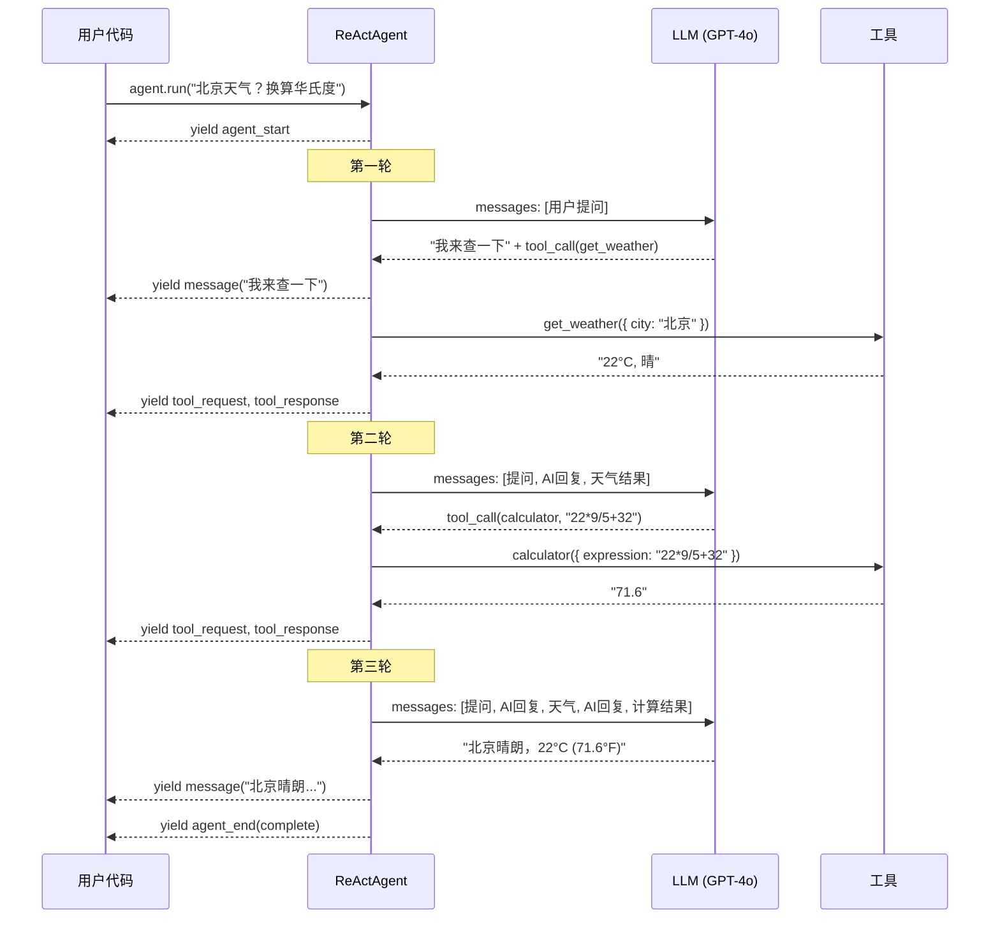

# 2. 核心循环 — 一个完整的例子

## 场景

用户问 Agent："北京今天天气怎么样？帮我换算成华氏度。"

Agent 有两个工具：`get_weather`（查天气）和 `calculator`（计算）。

我们一步一步看框架内部发生了什么。

## 第一幕：启动

```typescript
const agent = new ReActAgent({
  provider: openaiProvider,
  model: 'gpt-4o',
  tools: [getWeather, calculator],
  systemPrompt: '你是一个有用的助手。',
});

for await (const event of agent.run('北京今天天气怎么样？帮我换算成华氏度。')) {
  // 消费事件...
}
```

调用 `agent.run()` 时，框架做了这些初始化：

```
1. 生成 sessionId（唯一标识这次运行）
2. 状态机：idle → reacting
3. yield { type: 'agent_start', sessionId }
4. 把用户输入包装成 UserMessage，放进 messages 数组
5. 进入 executeLoop()
```

此时 messages 数组长这样：

```json
[
  { "role": "user", "content": "北京今天天气怎么样？帮我换算成华氏度。" }
]
```

## 第二幕：第一轮 LLM 调用

### 2.1 创建 ChatSession

```
provider.chat({
  model: 'gpt-4o',
  systemPrompt: '你是一个有用的助手。',
  tools: [get_weather 的 JSON Schema, calculator 的 JSON Schema]
})
```

框架先通过 `onToolFilter` 钩子过滤工具（ReActAgent 默认不过滤），然后通过 `ToolRegistry.toToolDefinitions()` 把 Zod schema 转成 JSON Schema：

```json
{
  "name": "get_weather",
  "description": "查询指定城市的天气",
  "parameters": {
    "type": "object",
    "properties": {
      "city": { "type": "string", "description": "城市名" }
    },
    "required": ["city"]
  }
}
```

### 2.2 上下文裁剪

如果配置了 `contextManager`，在发给 LLM 之前先检查消息总量是否超预算。现在才第一轮，消息很短，直接通过。

### 2.3 发送并收集流式响应

```
chatSession.sendMessage(messages) → AsyncGenerator<ChatStreamEvent>
```

LLM 的流式响应一块块到达：

```
TextStreamEvent:     "我来帮你查一下北京的天气"
TextStreamEvent:     "。"
ToolCallStreamEvent: { name: "get_weather", args: { city: "北京" } }
FinishStreamEvent:   { reason: "tool_calls" }
```

`collectResponse()` 方法把这些碎片**聚合**成一个结构化的结果：

```typescript
{
  text: "我来帮你查一下北京的天气。",
  toolCalls: [{ id: "call_abc", name: "get_weather", args: { city: "北京" } }],
  usage: { inputTokens: 150, outputTokens: 30 }
}
```

### 2.4 yield 事件

```
yield { type: 'message', role: 'assistant', content: '我来帮你查一下北京的天气。' }
yield { type: 'usage', inputTokens: 150, outputTokens: 30 }
```

消费者（比如你的 UI）立刻收到这些事件，可以实时显示。

### 2.5 判断：有工具调用吗？

`toolCalls` 不为空 → **有**，进入工具执行环节。

把 LLM 的回复记录到 messages：

```json
{
  "role": "assistant",
  "content": [
    { "type": "text", "text": "我来帮你查一下北京的天气。" },
    { "type": "tool_call", "toolCallId": "call_abc", "toolName": "get_weather", "args": { "city": "北京" } }
  ]
}
```

## 第三幕：工具执行

### 3.1 审批检查

框架检查：`requiresApproval(get_weather, policy)?`

- 如果 `approvalPolicy.mode === 'never'`（默认）→ 跳过
- 如果 `mode === 'tagged'` 且 `requireApprovalTags: ['write']`，而 get_weather 只有 `readonly` 标签 → 跳过
- 如果需要审批 → yield `approval_request` 事件，暂停等待用户决定

假设不需要审批，继续。

### 3.2 onBeforeToolCall 钩子

给外部一个修改或拦截的机会。默认什么都不做。

### 3.3 Scheduler → ToolExecutor

```
Scheduler 收到工具调用请求列表（这里只有 1 个）
  → ToolExecutor 处理每一个：
     1. 按 name 在 ToolRegistry 里查找工具  ✓ 找到 get_weather
     2. 用 Zod schema 验证参数  ✓ { city: "北京" } 合法
     3. 调用 tool.execute({ city: "北京" }, context)
     4. 返回结果
```

假设工具返回：

```json
{ "content": "北京今天晴，气温 22°C，湿度 45%" }
```

### 3.4 yield 工具事件

```
yield { type: 'tool_request', toolName: 'get_weather', args: { city: '北京' } }
yield { type: 'tool_response', toolName: 'get_weather', result: '北京今天晴，气温 22°C...' }
```

### 3.5 结果追加到 messages

```json
{
  "role": "tool",
  "content": [
    { "type": "tool_result", "toolCallId": "call_abc", "content": "北京今天晴，气温 22°C，湿度 45%" }
  ]
}
```

此时 messages 数组已经有 3 条消息了：用户提问 → AI 回复+工具调用 → 工具结果。

## 第四幕：第二轮 LLM 调用

回到循环开头，再次发送 messages 给 LLM。

LLM 看到天气是 22°C，知道还需要换算成华氏度，于是请求调用 calculator：

```
ToolCallStreamEvent: { name: "calculator", args: { expression: "22 * 9 / 5 + 32" } }
```

同样的流程：收集 → yield 事件 → 审批检查 → 执行 → 结果追加。

calculator 返回 `"71.6"`，追加到 messages。

## 第五幕：第三轮 LLM 调用 — 完成

LLM 现在有了所有信息，返回纯文本回复：

```
TextStreamEvent: "北京今天天气晴朗，气温 22°C（约 71.6°F），湿度 45%。"
FinishStreamEvent: { reason: "stop" }
```

**`reason: "stop"` + 没有 toolCalls** → 循环结束。

```
yield { type: 'message', content: '北京今天天气晴朗，气温 22°C（约 71.6°F），湿度 45%。' }
```

## 第六幕：收尾

```
1. conversationStore.save(sessionId, messages)  // 如果配置了持久化
2. 状态机：reacting → completed
3. yield { type: 'agent_end', reason: 'complete' }
```

## 完整时间线



## 消息数组的演变

这是理解 Agent 循环的关键 — 每一轮对话都在同一个 messages 数组上**追加**：

```
第一轮前:  [User]
第一轮后:  [User, Assistant+ToolCall, ToolResult]
第二轮后:  [User, Assistant+ToolCall, ToolResult, Assistant+ToolCall, ToolResult]
第三轮后:  [User, Assistant+ToolCall, ToolResult, Assistant+ToolCall, ToolResult, Assistant(纯文本)]
```

LLM 每次都能看到**完整的对话历史**，所以它知道之前做了什么、得到了什么结果。这也是为什么需要上下文管理 — 如果对话太长，消息数组会超出 LLM 的上下文窗口。

## 如果出错了？

### 场景 A：工具执行失败

```json
{ "content": "连接日志服务超时", "isError": true }
```

这个错误结果会像正常结果一样追加到 messages。LLM 看到 `isError: true` 后，可能会：
- 换个参数重试
- 告诉用户"日志服务暂时不可用"
- 用其他工具替代

**循环不会崩溃**，LLM 自己判断下一步。

### 场景 B：LLM 给了错误的参数

```
LLM 请求: calculator({ expression: "abc" })
Zod 验证: ✓ expression 是 string（Zod 层面没问题）
执行: eval("abc") 报错
返回: { content: "ReferenceError: abc is not defined", isError: true }
```

LLM 看到错误后通常会修正。

### 场景 C：超出 maxIterations

20 轮循环后 LLM 还在调工具 → 抛 `MaxIterationsError`。这是安全阀，防止失控。

---

下一篇：[Agent 策略 — ReAct vs Plan-and-Execute](./03-agent-strategies.md)
