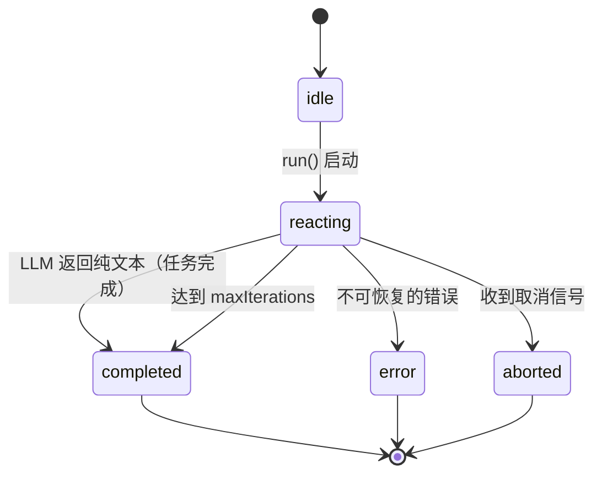
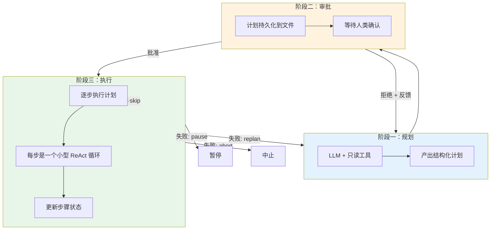
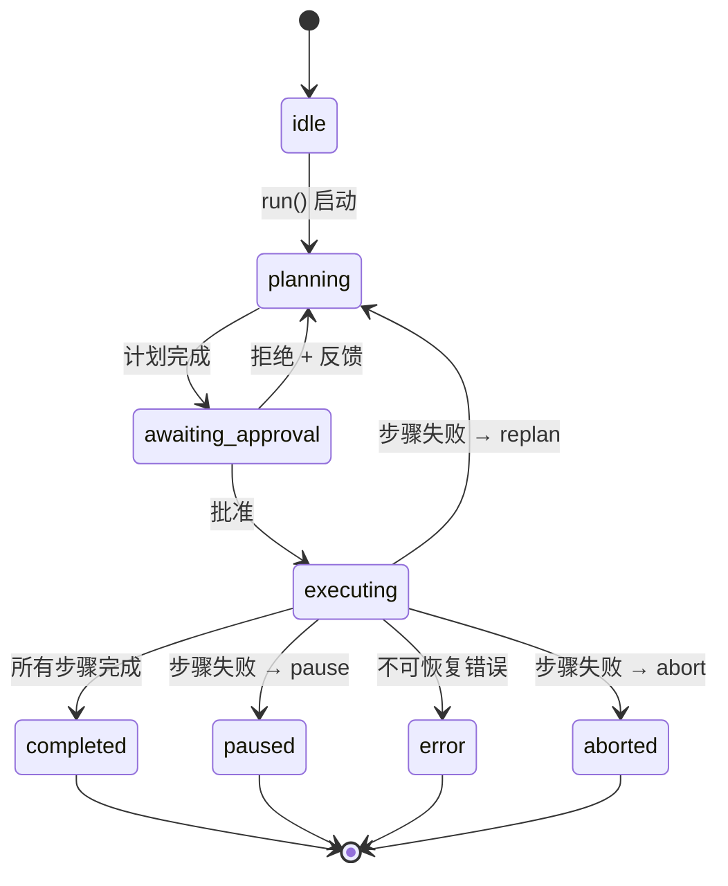

# 3. Agent 策略 — 两种思考方式

## 类比：做菜

**ReAct** 像一个经验丰富的厨师：看一眼菜单，直接开干。边做边调整 — 尝一口，加点盐，再尝一口，加点醋。灵活、快速，适合简单到中等复杂度的任务。

**Plan-and-Execute** 像一个项目经理式的厨师：先写好菜谱（几道菜、每道的步骤），让老板过目（审批），批准后严格按步骤执行。适合复杂任务，尤其是需要人类审批的场景。

## ReActAgent

### 核心逻辑

```
while (true) {
  response = LLM.send(messages)
  if (没有工具调用) break  // 完成
  执行工具，把结果追加到 messages
}
```

就这么简单。ReAct 的精髓在于：**让 LLM 自己决定每一步做什么**。框架只负责传话和执行工具。

### 状态转换



只有 3 个状态，转换关系清晰。

### Plan Mode（可选增强）

设置 `allowPlanMode: true` 后，框架会额外注入两个内置工具：

- `enter_plan_mode` — LLM 调用它表示"我想先规划一下"
- `exit_plan_mode` — LLM 调用它提交计划

这让 ReActAgent 在需要时临时进入计划模式，而不需要换成 PlanAndExecuteAgent。适合这种场景：大部分时候直接做就行，偶尔遇到复杂任务想先规划。

## PlanAndExecuteAgent

### 为什么需要它？

ReAct 有一个问题：**LLM 是逐步决策的**，它看不到全局。对于复杂任务（比如"重构这个模块"），LLM 可能做着做着就忘了最初的目标，或者走上一条低效的路径。

PlanAndExecuteAgent 解决这个问题：**先让 LLM 制定完整计划，人类审批后再执行**。

### 三个阶段



### 阶段一：规划（只读）

**关键约束：规划阶段只能用只读工具。**

为什么？因为计划还没被批准，不能有任何副作用。你不能一边"规划"一边偷偷改了代码。

框架通过 `onToolFilter` 钩子过滤，只保留 `tags` 包含 `'readonly'` 的工具。比如：
- `read_file` ✓（只是读文件）
- `search_code` ✓（只是搜索）
- `write_file` ✗（有副作用，被过滤掉）

LLM 利用只读工具了解现状，然后产出计划文本。框架把文本解析为结构化的 Plan：

```typescript
interface Plan {
  goal: string           // 总目标
  steps: PlanStep[]      // 步骤列表
}

interface PlanStep {
  description: string    // 步骤描述
  status: 'pending' | 'in_progress' | 'completed' | 'failed' | 'skipped'
}
```

解析策略：
1. 尝试提取编号列表（`1. xxx` 或 `1) xxx`）
2. 尝试提取项目符号列表（`- xxx`）
3. 降级：整段文本作为一个步骤

### 阶段二：审批

计划通过 `PlanStore` 持久化到 `.t-agent/plans/{sessionId}-{planId}.json`。

然后调用 `onPlanCreated(plan)` 钩子。这是一个**阻塞点** — Agent 停在这里，等你在外部代码中决定批准还是拒绝：

```typescript
const agent = new PlanAndExecuteAgent({
  // ...
  onPlanCreated: async (plan) => {
    console.log('计划:', plan.steps.map(s => s.description));
    const userInput = await askUser('批准这个计划吗？(yes/no/反馈)');

    if (userInput === 'yes') return { approved: true };
    return { approved: false, feedback: userInput };  // 反馈会传回给 LLM
  },
});
```

如果拒绝并提供反馈，Agent 回到阶段一，LLM 会看到反馈并重新规划。

### 阶段三：执行（完整工具集）

批准后，Agent 逐步执行计划。**每个步骤内部就是一个小型 ReAct 循环**：

```
对于 Plan 中的每个步骤:
  1. 创建新的 ChatSession（带完整工具集）
  2. 给 LLM 发送：系统提示 + 计划全文 + "现在执行第 N 步"
  3. LLM 做 ReAct 循环直到这一步完成
  4. 更新 PlanStore 中的步骤状态
  5. 下一步
```

**失败恢复**：如果某步执行失败，调用 `onStepFailed` 钩子，外部代码返回恢复策略：

| 策略      | 行为                           |
|----------|-------------------------------|
| `skip`   | 跳过这一步，继续下一步              |
| `pause`  | 暂停执行，yield `execution_paused` 事件 |
| `replan` | 带着失败信息回到阶段一，重新规划       |
| `abort`  | 终止整个 Agent                   |

### 状态转换



## 对比总结

| 维度 | ReActAgent | PlanAndExecuteAgent |
|------|-----------|-------------------|
| **思考方式** | 边想边做，逐步决策 | 先全局规划，再分步执行 |
| **人类参与** | 无（或通过审批系统按工具级别参与） | 计划级别的审批 + 步骤级别的错误恢复 |
| **适合场景** | 简单到中等任务，需要快速响应 | 复杂任务，需要全局规划和人类把关 |
| **工具过滤** | 无（所有工具始终可用） | 规划阶段仅只读，执行阶段完整 |
| **状态数** | 3 个 | 7 个 |
| **容错** | LLM 自行决定（看到错误后调整） | 结构化恢复策略（skip/pause/replan/abort） |
| **可审计** | 事件流 | 事件流 + 持久化计划文件 |

## BaseAgent：共享了什么？

两种 Agent 的差异只在 `executeLoop()` 和 `defineTransitions()` 的实现。其他所有东西都由 BaseAgent 提供：

```
BaseAgent 提供:
├── run() — 包装 executeLoop()，处理 agent_start/end
├── collectResponse() — 聚合 LLM 流式响应
├── executeToolCalls() — 审批检查 + 工具执行 + yield 事件
├── ToolRegistry — 工具注册和 JSON Schema 转换
├── Scheduler — 工具执行调度
├── StateMachine — 状态转换验证
├── ContextManager — 消息裁剪
└── 所有生命周期钩子的默认实现
```

这就是**模板方法模式**的威力：新写一种 Agent 策略（比如 TreeOfThoughtsAgent），只需要实现两个方法，其他一切基础设施都现成的。

---

下一篇：[工具系统](./04-tool-system.md)
