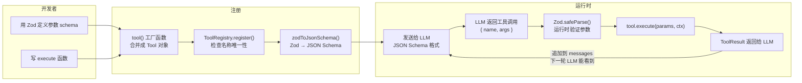
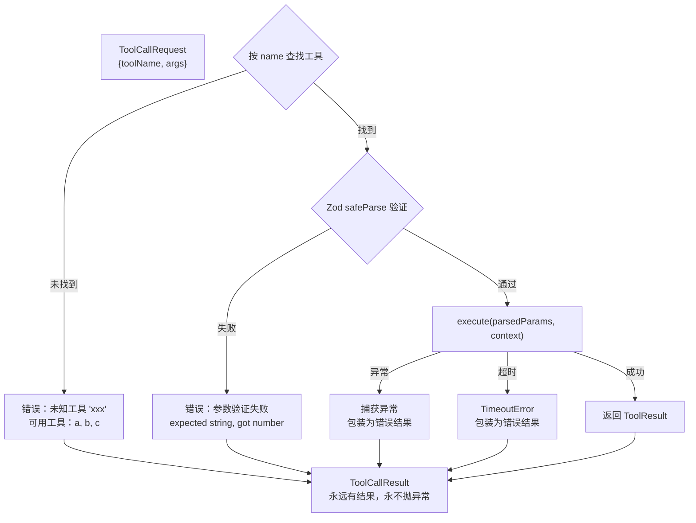

# 4. 工具系统

## 类比：瑞士军刀

LLM 是大脑，工具是四肢。没有工具的 LLM 只能空谈；有了工具，它才能真正做事。

工具系统就是框架的"手脚管理系统"：

- **定义**手脚长什么样（参数格式）
- **注册**到一个统一的库里
- 运行时**验证**LLM 给的指令格式对不对
- 最终**执行**并把结果报告回去

## 从定义到执行的全链路



注意 **Zod 被用了两次**：

1. 注册时：Zod → JSON Schema，告诉 LLM 参数长什么样
2. 执行时：Zod.safeParse() 验证 LLM 返回的参数是否合法

这就是 "**Zod 唯一真相源**" — 一份 schema，两个用途，保证 LLM 看到的约束和运行时验证的约束完全一致。

## 定义一个工具

```typescript
import { tool } from '@agent-tea/core';
import { z } from 'zod';

const searchCode = tool(
    {
        name: 'search_code',
        description: '在代码仓库中搜索匹配的代码片段',
        parameters: z.object({
            query: z.string().describe('搜索关键词或正则表达式'),
            filePattern: z.string().optional().describe('文件名过滤，如 "*.ts"'),
            maxResults: z.number().default(10).describe('最大返回条数'),
        }),
        tags: ['readonly'],
        timeout: 10000, // 可选：工具级超时（ms），优先于全局 toolTimeout
    },
    async ({ query, filePattern, maxResults }, context) => {
        // context 提供运行时环境
        const results = await grep(query, {
            cwd: context.cwd,
            glob: filePattern,
            limit: maxResults,
        });

        return {
            content: JSON.stringify(results), // 发给 LLM
            displayContent: formatForHuman(results), // 给 UI 显示（可选）
            data: { matchCount: results.length }, // 结构化数据（可选）
        };
    },
);
```

### tool() 工厂做了什么？

```typescript
function tool<T extends ZodType>(config, execute): Tool<z.infer<T>>;
```

泛型链：`parameters (Zod T)` → `z.infer<T>` → `execute` 函数的参数类型。

也就是说，你定义了 Zod schema 后，`execute` 函数的 `params` 参数会自动获得正确的 TypeScript 类型。不需要手动写 interface。

如果 `execute` 返回的是普通字符串，工厂会自动包装成 `{ content: string }`。

## ToolContext — 依赖注入

每次工具执行时，框架会注入一个 `ToolContext`：

```typescript
interface ToolContext {
    sessionId: string; // 当前会话 ID，用于追踪
    cwd: string; // 工作目录
    messages: readonly Message[]; // 当前对话历史（只读）
    signal: AbortSignal; // 取消信号
}
```

**为什么用依赖注入？**

工具不应该依赖全局状态。同一个工具可能在主 Agent 和 SubAgent 中同时运行（不同 sessionId），如果依赖全局变量就会混乱。通过 context 注入，每次调用都有自己独立的上下文。

`signal` 特别重要 — 如果用户取消了任务，工具可以通过检查 `signal.aborted` 来提前终止长时间操作。

## ToolResult — 灵活的返回值

```typescript
interface ToolResult {
    content: string; // 必填：发给 LLM 的文本
    displayContent?: string; // 可选：给人看的格式化内容
    data?: Record<string, unknown>; // 可选：给程序用的结构化数据
    isError?: boolean; // 可选：标记为错误
}
```

**为什么要分 content 和 displayContent？**

发给 LLM 的内容和展示给用户的内容往往不同：

```typescript
return {
    content: JSON.stringify(logEntries), // LLM 需要看原始数据来分析
    displayContent: '找到 142 条错误日志（显示前 5 条）...', // 用户只需要摘要
    data: { total: 142 }, // 程序可能要用数量做判断
};
```

## ToolRegistry — 注册与转换

```typescript
class ToolRegistry {
    register(tool: Tool): void; // 注册，名称冲突时抛异常
    get(name: string): Tool | undefined; // 按名称查找
    getAll(): Tool[]; // 所有已注册工具
    toToolDefinitions(): ToolDefinition[]; // Zod → JSON Schema，发给 LLM
}
```

**注册时的名称唯一性检查**很重要：如果两个工具同名，LLM 无法区分该调哪个。框架在启动时就检查，fail-fast。

**Zod → JSON Schema 转换细节**：

```typescript
zodToJsonSchema(tool.parameters, {
    target: 'openApi3', // 最兼容的格式（OpenAI/Anthropic/Gemini 都认识）
    $refStrategy: 'none', // 不生成 $ref 引用，完全展平
});
```

为什么用 `$refStrategy: 'none'`？因为 LLM 的工具 Schema 解析器通常不支持 `$ref`，展平后的 Schema 最可靠。

## 标签系统

工具的 `tags` 字段是一个字符串数组，框架在两个地方使用它：

### 1. 审批过滤

```typescript
// 配置：只有 'write' 标签的工具需要审批
approvalPolicy: { mode: 'tagged', requireApprovalTags: ['write'] }

// 工具定义
const deleteTool = tool({ ..., tags: ['write', 'irreversible'] }, ...);  // 需要审批
const readTool   = tool({ ..., tags: ['readonly'] }, ...);               // 不需要审批
```

### 2. 阶段过滤（PlanAndExecuteAgent）

规划阶段通过 `onToolFilter` 只暴露 `readonly` 标签的工具：

```typescript
// PlanAndExecuteAgent 内部逻辑
onToolFilter(tools) {
  if (this.phase === 'planning') {
    return tools.filter(t => t.tags?.includes('readonly'));
  }
  return tools;  // 执行阶段返回全部
}
```

**常用标签约定**：

| 标签           | 含义             | 示例                    |
| -------------- | ---------------- | ----------------------- |
| `readonly`     | 无副作用的读操作 | read_file, search_code  |
| `write`        | 有副作用的写操作 | write_file, delete_file |
| `irreversible` | 不可逆操作       | drop_table, send_email  |
| `internal`     | 框架内部工具     | enter_plan_mode         |

## Scheduler + ToolExecutor — 执行管线

### ToolExecutor：单个工具的执行



**五层防护**，每一层都不会让错误逃逸：

1. **工具不存在** → 返回可用工具列表（LLM 可以换一个）
2. **参数格式错误** → 返回具体哪个字段有问题（LLM 可以修正）
3. **执行抛异常** → 捕获并包装（LLM 看到错误信息后调整）
4. **执行超时** → `Promise.race` 检测，返回 `Tool [name] timed out after Xms`（LLM 可以缩小范围重试）
5. **正常返回** → 直接传递

### 工具超时

每个工具可以设置独立的超时时间，也可以通过全局配置统一控制：

```typescript
// 工具级超时（优先级最高）
const slowTool = tool({
  name: 'slow_search',
  timeout: 60000,  // 这个工具允许 60 秒
  ...
}, async (params) => { ... });

// 全局超时（AgentConfig）
const agent = new Agent({
  ...
  toolTimeout: 30000,  // 所有工具默认 30 秒
});
```

**优先级**：工具级 `timeout` > 全局 `toolTimeout` > 默认值（30s）。设为 `0` 或 `Infinity` 可禁用超时。

**实现方式**：`ToolExecutor` 用 `Promise.race` 竞赛工具执行和超时计时器。超时后不会中止工具执行（JavaScript 无法强制终止 Promise），但会立即返回错误结果，Agent 循环继续推进。工具可通过 `context.signal` 检查取消状态来主动清理。

### Scheduler：多个工具的编排

当 LLM 一次返回多个工具调用时（比如同时查天气和查日历），Scheduler 负责协调：

```typescript
class Scheduler {
    async *execute(requests, context): AsyncGenerator<ToolCallResult>;
}
```

**调度策略：并行为主，标签控制顺序。**

Scheduler 将工具调用请求分成两类：

- **无 `sequential` 标签的工具** → 放入同一组，用 `Promise.all` 并行执行
- **有 `sequential` 标签的工具** → 独立成组，按顺序执行

分组逻辑是贪心的：连续出现的非 sequential 工具被打包为一组并行执行，遇到 sequential 工具就单独执行，结果通过 AsyncGenerator 逐个 yield。

```
工具调用:  [search(并行), grep(并行), writeFile(顺序), readFile(并行)]
分组:     [search + grep](并行) → [writeFile](顺序) → [readFile](并行)
```

**为什么这样设计？**

- 大多数只读工具（搜索、读文件）天然无依赖，并行加速明显
- 写操作（`writeFile`、`executeShell`）可能有副作用，用 `sequential` 标签保证执行顺序
- Scheduler 和 ToolExecutor 分离 — 调度策略可以随时调整，不影响工具执行逻辑

## 内置工具

### 实用工具（6 个）

框架在 `packages/core/src/tools/builtin/` 提供了 6 个开箱即用的工具，覆盖文件操作、Shell 执行、代码搜索和网页抓取：

| 工具              | 名称             | 标签                  | 用途                                                                             |
| ----------------- | ---------------- | --------------------- | -------------------------------------------------------------------------------- |
| **readFile**      | `read_file`      | `readonly`            | 读取文件内容，支持行号范围（startLine/endLine），超过 2000 行自动截断            |
| **writeFile**     | `write_file`     | `write`, `sequential` | 创建或覆盖文件，自动创建父目录                                                   |
| **listDirectory** | `list_directory` | `readonly`            | 列出目录内容，显示文件大小和类型                                                 |
| **executeShell**  | `execute_shell`  | `sequential`          | 执行 Shell 命令，捕获 stdout/stderr，支持超时保护                                |
| **grep**          | `grep`           | `readonly`            | 正则搜索文件内容，自动跳过 node_modules/.git/dist 等，返回 `文件:行号: 匹配内容` |
| **webFetch**      | `web_fetch`      | `readonly`            | 抓取网页，HTML 转纯文本返回                                                      |

通过 SDK 的 `builtinTools` 扩展一行引入所有实用工具：

```typescript
import { Agent, builtinTools } from '@agent-tea/sdk';

const agent = new Agent({
    provider,
    model: 'gpt-4o',
    tools: [...builtinTools.tools],
    systemPrompt: [
        '你是一个编程助手。',
        builtinTools.instructions, // 自带使用说明
    ].join('\n\n'),
});
```

### 内部工具（Plan Mode）

另有两个内部工具，用于 ReActAgent 的 Plan Mode（`allowPlanMode: true` 时自动注入）：

```
enter_plan_mode
├── tags: ['readonly', 'internal']
├── 参数：无
└── 效果：通知 Agent 进入计划模式

exit_plan_mode
├── tags: ['internal']
├── 参数：{ plan: string }
└── 效果：提交计划文本，通知 Agent 退出计划模式
```

**实现细节**：这两个工具的 `execute` 函数本身几乎什么都不做。真正的状态切换发生在 `onBeforeToolCall` 钩子中 — Agent 在钩子里检测到是内置工具，就做对应的状态切换。这是钩子系统的典型用法。

---

下一篇：[Provider 适配层](./05-providers.md)
