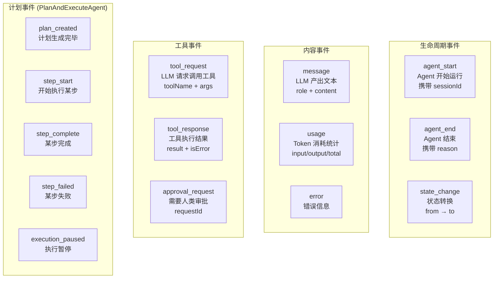

# 6. 事件流

## 类比：手术室的监控屏

手术进行中，监控屏实时显示心率、血压、血氧。医生不需要等手术结束才知道情况 — 每一秒都有反馈。

Agent 的事件流就是这块监控屏：Agent 在内部运转时，每做一步都会 yield 一个事件出来。你的 UI、日志系统、监控面板可以立刻捕获这些事件并实时响应。

## 为什么用 AsyncGenerator？

三种方案对比：

| 方案 | 代码示例 | 问题 |
|------|---------|------|
| **Promise** | `const result = await agent.run(input)` | 只能等全部完成，无法实时显示 |
| **回调** | `agent.run(input, { onMessage: fn, onTool: fn })` | 回调地狱，消费者无法控制节奏 |
| **AsyncGenerator** | `for await (const e of agent.run(input)) { ... }` | 流式 + 消费者主动拉取 + 可随时停止 |

AsyncGenerator 的优势：

1. **流式**：事件产生一个就能消费一个
2. **背压**：如果消费者处理慢，生产者自动等待（不会积压）
3. **取消**：消费者 `break` 或 Agent 收到 `AbortSignal` 就停止
4. **组合**：可以用 `for await` 消费，也可以管道到其他 AsyncGenerator

## 事件类型全览



### 事件产出时机

一次典型的 ReAct 运行中，事件的产出顺序：

```
agent_start          ─── Agent 启动
state_change         ─── idle → reacting
│
│ ┌── 第一轮迭代 ──────────────────────────────┐
│ │ message          ─── LLM 的文本输出         │
│ │ usage            ─── Token 消耗             │
│ │ tool_request     ─── LLM 想调用 search_log  │
│ │ tool_response    ─── search_log 返回了结果   │
│ └─────────────────────────────────────────────┘
│
│ ┌── 第二轮迭代 ──────────────────────────────┐
│ │ message          ─── LLM 的最终分析         │
│ │ usage            ─── Token 消耗             │
│ │ (没有 tool_request → 循环结束)              │
│ └─────────────────────────────────────────────┘
│
state_change         ─── reacting → completed
agent_end            ─── reason: 'complete'
```

PlanAndExecuteAgent 还会额外产出 plan_created、step_start/complete/failed 等事件。

## 消费模式

### 模式一：完整消费（最常见）

```typescript
for await (const event of agent.run(input)) {
  switch (event.type) {
    case 'agent_start':
      console.log(`会话 ${event.sessionId} 开始`);
      break;
    case 'message':
      // 实时输出文字
      process.stdout.write(event.content);
      break;
    case 'tool_request':
      console.log(`\n🔧 调用 ${event.toolName}(${JSON.stringify(event.args)})`);
      break;
    case 'tool_response':
      console.log(`✅ 结果: ${event.result.content.slice(0, 100)}...`);
      break;
    case 'usage':
      totalTokens += event.totalTokens ?? 0;
      break;
    case 'error':
      console.error(`❌ ${event.error.message}`);
      break;
    case 'agent_end':
      console.log(`\n完成 (${event.reason}), 总 token: ${totalTokens}`);
      break;
  }
}
```

### 模式二：带审批的消费

```typescript
for await (const event of agent.run(input)) {
  if (event.type === 'approval_request') {
    // Agent 在等你做决定，这里可以弹个对话框
    const userChoice = await showApprovalDialog({
      tool: event.toolName,
      args: event.args,
      description: event.toolDescription,
    });

    // 告诉 Agent 你的决定
    agent.resolveApproval(event.requestId, {
      approved: userChoice.approved,
      reason: userChoice.reason,
      modifiedArgs: userChoice.modifiedArgs,  // 可以修改参数
    });
  }
  // ... 处理其他事件
}
```

**关键细节**：`approval_request` 事件产出后，Agent 内部暂停在那里等你调 `resolveApproval()`。你可以花任意长时间做决定 — 是异步等待，不会阻塞线程。

### 模式三：SSE 推送（Web 服务场景）

```typescript
// NestJS 控制器
@Sse('chat')
async *chat(@Query('input') input: string) {
  for await (const event of agent.run(input)) {
    yield { data: JSON.stringify(event) };
  }
}
```

AsyncGenerator 天然适配 Server-Sent Events — 每个事件直接序列化后推送给前端。

### 模式四：提前终止

```typescript
const controller = new AbortController();

// 5 秒后超时
setTimeout(() => controller.abort(), 5000);

for await (const event of agent.run(input, controller.signal)) {
  if (event.type === 'message' && event.content.includes('完成')) {
    break;  // 消费者主动停止
  }
}
```

两种停止方式：
- `AbortSignal`：从外部发信号给 Agent
- `break`：消费者不再消费事件（Agent 下次 yield 时会收到提示）

## 事件与可辨识联合

所有事件都有 `type` 字段，TypeScript 在 `switch/case` 中自动收窄类型：

```typescript
for await (const event of agent.run(input)) {
  // event 的类型是 AgentEvent（联合类型）

  if (event.type === 'usage') {
    // TypeScript 自动知道这里 event 是 UsageEvent
    // 可以安全访问 event.inputTokens, event.outputTokens
    console.log(event.inputTokens);  // ✓ 类型安全
  }

  if (event.type === 'message') {
    // TypeScript 自动知道这里 event 是 MessageEvent
    console.log(event.content);       // ✓ 类型安全
    console.log(event.inputTokens);   // ✗ 编译错误！MessageEvent 没有这个字段
  }
}
```

这就是可辨识联合的好处：不需要类型断言，TypeScript 编译器帮你检查所有分支是否正确。

---

下一篇：[可选子系统 — 审批、上下文、记忆](./07-subsystems.md)
