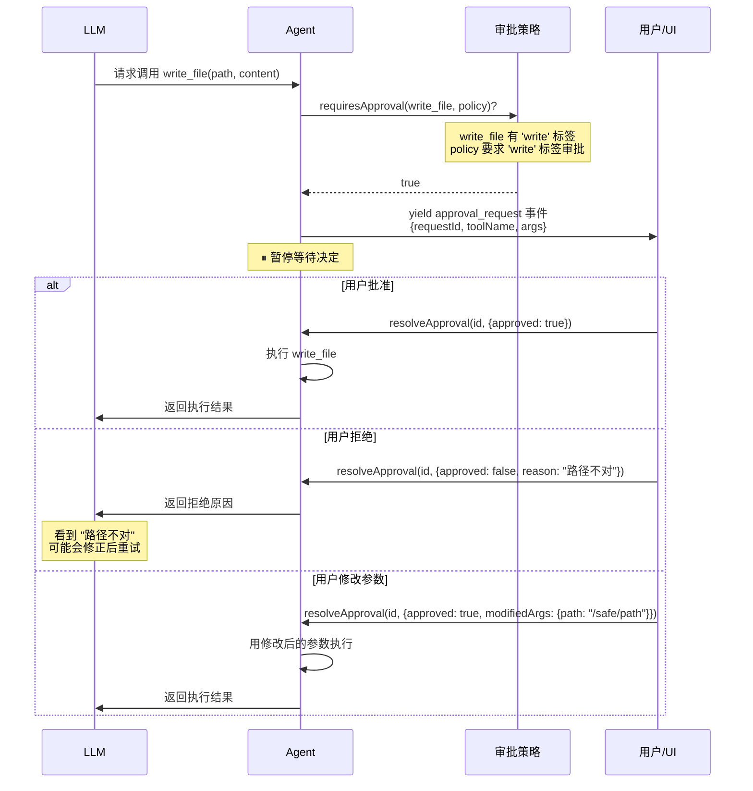
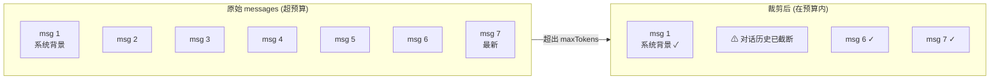

# 7. 可选子系统 — 审批、上下文管理、记忆、循环检测

## 设计哲学：默认关闭，按需启用

这三个子系统有一个共同特点：**不配置就完全不存在**。

```typescript
// 最简配置 — 没有审批、没有上下文管理、没有持久化
const agent = new Agent({ provider, model: 'gpt-4o', tools: [...] });

// 完整配置 — 三个子系统全开
const agent = new Agent({
  provider,
  model: 'gpt-4o',
  tools: [...],
  approvalPolicy: { mode: 'tagged', requireApprovalTags: ['write'] },
  contextManager: { maxTokens: 8000 },
  conversationStore: new FileConversationStore('.t-agent/conversations'),
  memoryStore: new FileMemoryStore('.t-agent/memory'),
});
```

这是**向后兼容**的关键：已有代码不需要任何修改，新功能只对显式启用的用户生效。

---

## 审批系统

### 解决什么问题？

LLM 有时会做出危险操作 — 删除文件、发送邮件、修改数据库。你可能希望这些操作在执行前先经过人类确认。

### 类比：公司审批流

```
普通员工（LLM）想做一件事:
  ├── 买文具（只读操作） → 直接做，不需要审批
  ├── 报销 500 元（写操作） → 需要主管签字
  └── 签百万合同（不可逆操作） → 需要总监签字
```

审批系统就是这个流程的代码版。

### 三种模式

```typescript
type ApprovalPolicy = {
  mode: 'never' | 'always' | 'tagged'
  requireApprovalTags?: string[]
}
```

| 模式 | 行为 | 适用场景 |
|------|------|---------|
| `never` | 所有工具自动执行 | 开发测试、完全信任 LLM |
| `always` | 所有工具都需审批 | 最高安全要求 |
| `tagged` | 仅匹配标签的工具需审批 | **推荐** — 平衡安全与效率 |

### 工作流程



### 关键设计

**1. 拒绝原因发给 LLM**

```typescript
// 用户拒绝
resolveApproval(id, {
  approved: false,
  reason: '不要删除 production 数据库，请删 staging 的'
});
```

LLM 会看到这个原因，通常能理解并调整策略。这比简单的"拒绝"更智能。

**2. modifiedArgs — 在执行前修正参数**

```typescript
// 用户看到 LLM 想删 /data/important.log，修正为 /tmp/old.log
resolveApproval(id, {
  approved: true,
  modifiedArgs: { filePath: '/tmp/old.log' }
});
```

不需要拒绝再等 LLM 重试，直接改参数，一步到位。

**3. 非阻塞**

`approval_request` 是通过 `yield` 产出的事件。Agent 内部用 Promise 等待决定，但不会阻塞 JavaScript 线程。适合 CLI（readline 等输入）、Web（HTTP 长连接等待前端点击）。

### 与标签的关系

审批系统复用了工具的 `tags` 字段，不需要额外的配置：

```typescript
// 工具定义时打标签
const deleteFile = tool({ ..., tags: ['write', 'irreversible'] }, ...);
const readFile   = tool({ ..., tags: ['readonly'] }, ...);

// 配置时指定哪些标签需要审批
approvalPolicy: { mode: 'tagged', requireApprovalTags: ['write'] }
// → deleteFile 需要审批（有 'write' 标签）
// → readFile 不需要审批（只有 'readonly' 标签）
```

---

## 上下文管理

### 解决什么问题？

LLM 有上下文窗口限制（比如 128K tokens）。Agent 循环中，messages 数组不断增长 — 每轮对话都追加 LLM 回复和工具结果。如果不管理，最终会超出窗口导致 API 报错或信息丢失。

### 类比：会议纪要

一个持续两小时的会议，你不可能记住所有讨论内容。但你会保留：
- **会议开头的背景介绍**（重要的上下文）
- **最近 15 分钟的讨论**（最相关的内容）
- 中间的内容？一个简短的摘要："... 中间讨论了若干技术方案 ..."

这就是**滑动窗口**策略。

### SlidingWindowContextManager



**算法**：

```
1. 估算总 token（字符数 ÷ 4，粗略但够用）
2. 如果在预算内 → 原样返回
3. 如果超预算：
   a. 保留前 N 条消息（reservedMessageCount，默认 1）
   b. 从尾部向前保留最新消息，直到 token 用满
   c. 在保留消息和最新消息之间插入截断标记
4. 返回新数组（不修改原始消息）
```

### PipelineContextManager（推荐）

当需要更精细的控制时，使用管道策略。多个处理器依次加工消息数组：

```
原始 messages
  │
  ├─ ToolOutputTruncator    截断过长的工具输出（保留头尾）
  ├─ SlidingWindowProcessor  滑动窗口裁剪
  └─ MessageCompressor       消息压缩（占位，待异步支持）
  │
  ▼
裁剪后的 messages
```

每个处理器实现 `ContextProcessor` 接口，只需一个 `process(messages, budget)` 方法。处理器之间互不依赖，可以自由组合。

### 配置

```typescript
// 简单模式 — 滑动窗口
contextManager: {
  maxTokens: 8000,
  strategy: 'sliding_window',
  reservedMessageCount: 1,
}

// 管道模式 — 多处理器组合（推荐）
contextManager: {
  maxTokens: 8000,
  strategy: 'pipeline',
  processors: [
    new ToolOutputTruncator({ maxLength: 2000 }),   // 先截断长工具输出
    new SlidingWindowProcessor({ reservedMessageCount: 1 }),  // 再做滑动窗口
  ],
}
```

通过 `createContextManager()` 工厂函数创建，根据 `strategy` 字段自动选择实现。

### 调用时机

`BaseAgent.collectResponse()` 在**每次发给 LLM 之前**自动调用：

```typescript
// BaseAgent 内部
async collectResponse(session, messages, signal) {
  const prepared = this.contextManager
    ? this.contextManager.prepare(messages)
    : messages;

  for await (const event of session.sendMessage(prepared, signal)) {
    // ...
  }
}
```

**非破坏性**：`prepare()` 返回新数组，原始 messages 保持完整（持久化时保存的是完整历史）。

### 为什么用字符数 ÷ 4 估算 token？

精确的 token 计算需要 tokenizer（如 tiktoken），会引入额外依赖。`字符数 ÷ 4` 是一个广泛使用的近似值，对英文约 ±20% 误差，对中文会偏差更大。但对于裁剪决策来说足够了 — 宁可多裁一点，也不要超出窗口报错。

未来可以扩展 `ContextManager` 接口，支持基于 tokenizer 的精确计算。

---

## 记忆与持久化

### 解决什么问题？

默认的 Agent 是"无记忆"的 — 每次 `run()` 结束，对话历史就消失了。两个层面的持久化需求：

1. **会话级**：保存一次完整对话，下次可以继续或回放
2. **知识级**：跨会话积累的知识（"用户偏好用简体中文"、"项目用的是 PostgreSQL 15"）

### 类比：笔记本 vs 知识库

- **ConversationStore**（会话存储）像**聊天记录** — 一条一条的消息，按会话隔离
- **MemoryStore**（记忆存储）像**个人 wiki** — 键值对 + 标签，跨会话搜索

### ConversationStore — 会话级持久化

```typescript
interface ConversationStore {
  save(sessionId: string, messages: Message[], metadata?: Record<string, unknown>): Promise<void>
  load(sessionId: string): Promise<{ messages: Message[], metadata?: Record<string, unknown> } | null>
  list(): Promise<Array<{ sessionId: string, metadata?: Record<string, unknown> }>>
  delete(sessionId: string): Promise<void>
}
```

**FileConversationStore** 的存储结构：

```
.t-agent/conversations/
├── sess_abc123.json    # 会话 1 的完整消息历史
├── sess_def456.json    # 会话 2
└── ...
```

每个文件的内容：

```json
{
  "sessionId": "sess_abc123",
  "messages": [ ... ],
  "metadata": {
    "createdAt": "2024-03-15T10:00:00Z",
    "updatedAt": "2024-03-15T10:05:00Z",
    "model": "gpt-4o"
  }
}
```

**使用场景**：
- 对话续接：加载历史消息后继续对话
- 审计日志：回看 Agent 做了什么
- 调试：重放问题对话

### MemoryStore — 知识级持久化

```typescript
interface MemoryStore {
  set(key: string, content: string, tags?: string[]): Promise<void>
  get(key: string): Promise<MemoryEntry | null>
  search(tags?: string[]): Promise<MemoryEntry[]>
  delete(key: string): Promise<void>
  list(): Promise<MemoryEntry[]>
}

interface MemoryEntry {
  key: string
  content: string
  tags: string[]
  createdAt: string
  updatedAt: string
}
```

**FileMemoryStore** 的存储结构：

```
.t-agent/memory/
├── index.json              # 索引文件，快速查找
└── entries/
    ├── user-preference.json
    ├── project-stack.json
    └── ...
```

**index.json 示例**：

```json
{
  "entries": {
    "user-preference": { "tags": ["user", "preference"], "updatedAt": "..." },
    "project-stack": { "tags": ["project", "tech"], "updatedAt": "..." }
  }
}
```

**使用场景**：

```typescript
// Agent 的工具可以读写记忆
const rememberTool = tool({
  name: 'remember',
  description: '记住一个重要信息，以便将来使用',
  parameters: z.object({
    key: z.string(),
    content: z.string(),
    tags: z.array(z.string()).optional(),
  }),
}, async ({ key, content, tags }, ctx) => {
  await memoryStore.set(key, content, tags);
  return { content: `已记住: ${key}` };
});

const recallTool = tool({
  name: 'recall',
  description: '回忆之前记住的信息',
  parameters: z.object({
    tags: z.array(z.string()).optional(),
  }),
}, async ({ tags }) => {
  const entries = await memoryStore.search(tags);
  return { content: JSON.stringify(entries) };
});
```

### 两层存储的关系

```
                    时间线 →
会话 1: [msg1, msg2, msg3, ...]  → ConversationStore 保存完整历史
           ↓ 提取知识
        "用户偏好中文"            → MemoryStore 保存知识条目
                                          ↓ 被未来会话使用
会话 2: [msg1(含记忆上下文), ...]  ← 加载相关记忆注入到系统提示
```

- ConversationStore 是**流水账** — 按会话隔离，完整记录
- MemoryStore 是**精华笔记** — 跨会话共享，按标签搜索

### 为什么不用向量数据库？

当前的 MemoryStore 是基于标签的键值搜索，没有语义搜索（向量相似度）。原因：

1. **依赖最小化** — Core 层不引入 embedding 模型或向量库
2. **标签搜索够用** — 对于大多数 Agent 场景，记忆条目数量不多（几十到几百），精确标签比模糊语义更可靠
3. **可扩展** — 如果需要语义搜索，可以在 SDK 层实现一个 `VectorMemoryStore`，实现同样的 `MemoryStore` 接口

---

## 循环检测

### 解决什么问题？

Agent 有时会陷入死循环 — 反复调用同一个工具（参数一模一样），或者 LLM 反复输出相同内容。`maxIterations` 是最后的安全阀，但循环检测能更早发现问题，给 LLM 一个自我纠正的机会。

### 类比：导航的"你似乎在绕圈"

开车跟着导航走，如果连续三次经过同一个路口，导航会提醒你"你似乎在绕圈，要重新规划路线吗？"。循环检测做的就是这件事。

### 两种探测器

**1. ToolCallTracker — 检测重复工具调用**

连续 N 次调用同一个工具、传同样的参数（按参数哈希判断，参数顺序无关），判定为循环。

```
call_1: grep({ query: "error", path: "/logs" })
call_2: grep({ query: "error", path: "/logs" })  ← 第 2 次
call_3: grep({ query: "error", path: "/logs" })  ← 第 3 次，触发！
```

当 LLM 输出纯文本时计数器重置 — 说明 LLM 在"思考"，不算重复。

**2. ContentTracker — 检测内容重复模式**

将 LLM 输出分成 50 字符的块，计算哈希。如果相同的哈希以近似周期出现（间隔方差 < 平均间隔的 30%），判定为内容重复。代码块会被忽略，避免误报。

### 升级策略

检测到循环后不会立刻中止，而是分两步：

1. **第一次检测** → 向消息中注入**警告提示**，给 LLM 一个自我纠正的机会
2. **超过 `maxWarnings` 次** → 抛 `LoopDetectedError`，中止 Agent

### 配置

```typescript
loopDetection: {
  enabled: true,                       // 默认关闭
  maxConsecutiveIdenticalCalls: 3,     // 连续相同调用次数阈值
  contentRepetitionThreshold: 5,       // 内容重复模式次数阈值
  maxWarnings: 1,                      // 警告后再犯几次就中止
}
```

和其他子系统一样，不配置就完全不存在 — 零开销。

---

## 四个子系统的集成点

它们在 BaseAgent 中的嵌入位置：

```
Agent.run()
│
├─ 每轮 LLM 调用前
│   └─ contextManager.prepare(messages)     ← 上下文管理
│
├─ 每轮 LLM 响应后
│   └─ loopDetector.check(response)         ← 循环检测
│
├─ 每次工具执行前
│   ├─ requiresApproval(tool, policy)?      ← 审批检查
│   └─ yield approval_request / 等待决定
│
└─ 运行结束后
    └─ conversationStore.save(sessionId, messages)  ← 持久化
```

四者互不依赖，可以任意组合：
- 只要审批，不要持久化 ✓
- 只要上下文管理 + 循环检测 ✓
- 全部启用 ✓
- 全部不启用 ✓

---

下一篇：[SDK 与多 Agent 协作](./08-sdk.md)
