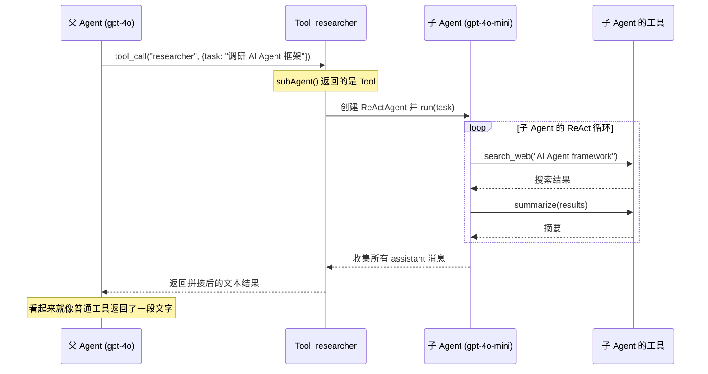

# 8. SDK 与多 Agent 协作

## SDK 层的定位

Core 是发动机，SDK 是方向盘和仪表盘。

Core 提供了完整的 Agent 能力，但直接用 Core 就像直接操控发动机 — 能做所有事，但不够方便。SDK 在 Core 之上提供三个高层抽象，让开发者更高效：

```
SDK 抽象         类比                Core 对应
─────────────────────────────────────────────
Extension        插件/能力包          tools[] + systemPrompt
Skill            任务配方             tools[] + 触发指令
SubAgent         子代理 → 包装成 Tool  ReActAgent → tool()
```

## Extension — 能力包

### 类比：手机 App

你的手机（Agent）出厂时什么 App 都没有。安装"地图 App"后，手机就有了导航能力。Extension 就是给 Agent 安装的 App — 把一组相关的工具和行为指令打包在一起。

### 结构

```typescript
interface Extension {
  name: string
  description?: string
  instructions?: string    // 注入到系统提示词中
  tools?: Tool[]           // 打包的工具
  skills?: Skill[]         // 打包的技能
}
```

### 例子

```typescript
const webExtension = extension({
  name: 'web-tools',
  description: 'Web 搜索和内容抓取能力',
  instructions: `你可以使用 web_search 搜索互联网信息，使用 web_fetch 抓取网页内容。
                 优先搜索最新信息，不要依赖训练数据中的过时信息。`,
  tools: [webSearchTool, webFetchTool],
});

const codeExtension = extension({
  name: 'code-tools',
  description: '代码读写能力',
  instructions: '修改代码前先读取完整文件，理解上下文后再动手。',
  tools: [readFileTool, writeFileTool, searchCodeTool],
});
```

### 使用

```typescript
// 给 Agent 安装多个 Extension
const agent = new Agent({
  provider,
  model: 'gpt-4o',
  tools: [
    ...webExtension.tools,
    ...codeExtension.tools,
  ],
  systemPrompt: [
    '你是一个全能助手。',
    webExtension.instructions,
    codeExtension.instructions,
  ].join('\n\n'),
});
```

**Extension 的价值**：复用。你写一次 `webExtension`，可以给 10 个不同的 Agent 用。团队 A 的 Agent 装 web + code，团队 B 的 Agent 只装 code。

### builtinTools — 框架自带的 Extension

框架预置了一个 `builtinTools` 扩展，打包了 6 个常用工具（readFile、writeFile、listDirectory、executeShell、grep、webFetch）和配套的使用说明：

```typescript
import { Agent, builtinTools } from '@agent-tea/sdk';

const agent = new Agent({
  provider,
  model: 'gpt-4o',
  tools: [...builtinTools.tools],
  systemPrompt: [
    '你是一个编程助手。',
    builtinTools.instructions,
  ].join('\n\n'),
});
```

不需要自己定义文件操作工具 — 一行 `builtinTools` 就能让 Agent 读写文件、执行命令、搜索代码。详见 [工具系统 — 内置工具](./04-tool-system.md#内置工具)。

## Skill — 任务配方

### 类比：菜谱

Extension 是"一套厨具"（工具集），Skill 是"一份菜谱"（工具 + 做法）。

菜谱不只是告诉你要用什么锅（工具），还告诉你怎么做（指令）和什么时候用这个菜谱（触发条件）。

### 结构

```typescript
interface Skill {
  name: string
  description: string
  instructions: string     // 任务特定的行为指令
  tools?: Tool[]           // 任务需要的工具
  trigger?: string         // 触发条件，如 '/review'
}
```

### 例子

```typescript
const codeReviewSkill = skill({
  name: 'code-review',
  description: '审查代码变更，找出潜在问题',
  trigger: '/review',
  instructions: `执行代码审查时，请遵循以下流程：
    1. 先用 git_diff 获取变更内容
    2. 用 read_file 阅读变更文件的完整上下文
    3. 逐文件分析：安全性、性能、可维护性
    4. 输出结构化的审查报告`,
  tools: [gitDiffTool, readFileTool, searchCodeTool],
});

const logAnalysisSkill = skill({
  name: 'log-analysis',
  description: '分析日志，诊断错误根因',
  trigger: '/analyze',
  instructions: `日志分析流程：
    1. 先搜索错误级别日志
    2. 识别错误模式和时间线
    3. 关联相关代码
    4. 给出根因分析和修复建议`,
  tools: [searchLogTool, readFileTool],
});
```

### Skill vs Extension

| 维度 | Extension | Skill |
|------|-----------|-------|
| 目的 | 打包可复用能力 | 定义任务执行方式 |
| 有行为指令 | 可选（通用性的） | 必填（任务特定的） |
| 有触发条件 | 无 | 有（如 `/review`） |
| 粒度 | 粗（一组能力） | 细（一个任务） |
| 类比 | 工具箱 | 操作手册 |

两者可以组合：一个 Extension 里可以包含多个 Skill。

## SubAgent — 子代理

### 核心思想

**把一个完整的 Agent 包装成一个 Tool。**

父 Agent 调用子 Agent 就像调用普通工具一样 — 传入任务描述，等待结果返回。子 Agent 内部运行完整的 ReAct 循环，但父 Agent 不需要知道这些细节。

### 类比：公司组织架构

```
CEO（父 Agent，高级模型）
├── 做战略决策
├── 当遇到"调研竞品"任务时 → 委派给市场部
│
└── 市场分析师（子 Agent，轻量模型）
    ├── 自己有搜索工具、整理工具
    ├── 独立完成调研
    └── 把报告交回给 CEO
```

CEO 只说"帮我调研竞品"，不管市场分析师具体怎么搜索、怎么整理。这就是 SubAgent 的价值：**透明委派**。

### 工作原理



### 代码实现

```typescript
import { subAgent } from '@agent-tea/sdk';

const researcher = subAgent({
  name: 'researcher',
  description: '深度调研一个主题，返回结构化的调研报告',
  provider: openaiProvider,        // 可以共享父 Agent 的 provider
  model: 'gpt-4o-mini',           // 也可以用更便宜的模型
  tools: [webSearchTool, summarizeTool],
  systemPrompt: '你是一个调研分析师。给定主题后，搜索信息并产出结构化报告。',
  maxIterations: 10,               // 比父 Agent 的 20 更保守
});

// researcher 是一个 Tool，可以直接放进父 Agent 的工具列表
const parentAgent = new Agent({
  provider: openaiProvider,
  model: 'gpt-4o',
  tools: [researcher, calculatorTool, ...otherTools],
  systemPrompt: '你是一个全能助手。需要深度调研时，使用 researcher 工具。',
});
```

### 内部实现细节

`subAgent()` 函数做了什么：

```typescript
function subAgent(config: SubAgentConfig): Tool {
  // 1. 创建一个 ReActAgent 实例（初始化时就创建，后续复用）
  const agent = new ReActAgent({
    provider: config.provider,
    model: config.model,
    tools: config.tools ?? [],
    systemPrompt: config.systemPrompt,
    maxIterations: config.maxIterations ?? 10,
  });

  // 2. 包装成 Tool
  return tool(
    {
      name: config.name,
      description: config.description,
      parameters: z.object({
        task: z.string().describe('要委派给子代理的任务描述'),
      }),
    },
    async ({ task }) => {
      const messages: string[] = [];

      // 3. 运行子 Agent，收集所有 assistant 消息
      for await (const event of agent.run(task)) {
        if (event.type === 'message' && event.role === 'assistant') {
          messages.push(event.content);
        }
      }

      return { content: messages.join('\n\n') };
    }
  );
}
```

关键点：
- 子 Agent 的所有事件（tool_request、tool_response 等）**不会**冒泡到父 Agent — 父 Agent 只看到最终的文本结果
- 子 Agent 用 `ReActAgent`，所以有完整的推理-行动循环能力
- `maxIterations` 默认 10（比父 Agent 的 20 更保守），防止子任务失控

### 多级嵌套

SubAgent 返回的是 Tool，而 Agent 可以持有 Tool。所以子 Agent 也可以有自己的子 Agent：

```
CEO Agent (gpt-4o)
├── Tool: researcher
│   └── Sub Agent (gpt-4o-mini)
│       ├── Tool: web_search
│       └── Tool: fact_checker
│           └── Sub Sub Agent (gpt-4o-mini)
│               └── Tool: search_academic_papers
└── Tool: calculator
```

**注意**：嵌套层级越多，总体延迟和 token 消耗越大。实际使用中 2-3 层就够了。

### SubAgent 的优势

| 优势 | 说明 |
|------|------|
| **专业化** | 子 Agent 有针对性的工具集和提示词 |
| **成本优化** | 子 Agent 可以用更便宜的模型 |
| **隔离性** | 子 Agent 失败不影响父 Agent（错误被包装为 ToolResult） |
| **透明性** | 父 Agent 不需要知道子 Agent 的内部实现 |
| **复用性** | 同一个 SubAgent 可以被多个父 Agent 使用 |

## 完整示例：构建一个日志分析 Agent

把所有 SDK 概念组合起来：

```typescript
import { Agent, extension, skill, subAgent, tool } from '@agent-tea/sdk';
import { OpenAIProvider } from '@agent-tea/provider-openai';
import { z } from 'zod';

// === 工具定义 ===
const searchLog = tool({ name: 'search_log', ... }, async ({ keyword }) => { ... });
const readFile  = tool({ name: 'read_file', tags: ['readonly'], ... }, async ({ path }) => { ... });
const writeFile = tool({ name: 'write_file', tags: ['write'], ... }, async ({ path, content }) => { ... });
const searchCode = tool({ name: 'search_code', tags: ['readonly'], ... }, async ({ query }) => { ... });

// === Extension：打包代码读写能力 ===
const codeExt = extension({
  name: 'code-tools',
  instructions: '修改代码前先阅读完整文件。',
  tools: [readFile, writeFile, searchCode],
});

// === SubAgent：专门做代码分析的子代理 ===
const codeAnalyzer = subAgent({
  name: 'code_analyzer',
  description: '分析代码变更和错误堆栈，找出可能的 bug',
  provider: new OpenAIProvider(),
  model: 'gpt-4o-mini',
  tools: [readFile, searchCode],
  systemPrompt: '你是代码分析专家。给定错误信息和代码库，定位问题根因。',
});

// === 主 Agent ===
const agent = new Agent({
  provider: new OpenAIProvider(),
  model: 'gpt-4o',
  tools: [searchLog, ...codeExt.tools, codeAnalyzer],
  systemPrompt: `你是运维诊断助手。收到告警后：
    1. 搜索相关日志
    2. 使用 code_analyzer 分析代码
    3. 综合产出诊断报告`,
  approvalPolicy: { mode: 'tagged', requireApprovalTags: ['write'] },
});

// === 运行 ===
for await (const event of agent.run('服务 user-api 响应时间突增，请诊断')) {
  switch (event.type) {
    case 'message':
      console.log(event.content);
      break;
    case 'approval_request':
      // 写操作需要人工确认
      const ok = await readline.question(`批准 ${event.toolName}? (y/n) `);
      agent.resolveApproval(event.requestId, { approved: ok === 'y' });
      break;
  }
}
```

**这个例子展示了**：
- `extension()` 打包代码工具
- `subAgent()` 创建专门的代码分析子代理
- 审批系统保护写操作
- 事件流驱动 UI 交互

---

以上就是 agent-tea 框架的完整架构文档。回到 [文档索引](./README.md) 查看所有章节。
