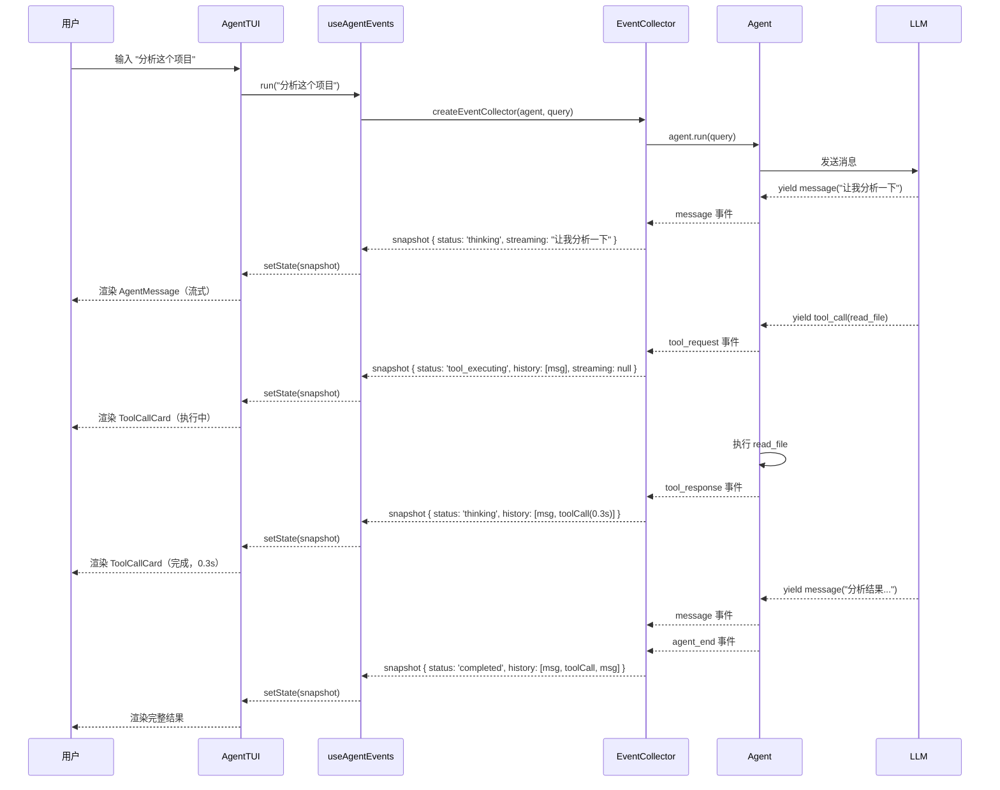

# 9. 终端 UI — 让 Agent 看得见摸得着

## 类比：控制台仪表盘

Agent 在后台工作时，你看到的只是一堆事件日志。TUI 包把这些事件翻译成**实时的终端界面**：Agent 在思考时显示"thinking"，调用工具时显示工具卡片和耗时，需要审批时弹出对话框——就像汽车的仪表盘把发动机的工作状态翻译成转速表、油量表、警告灯。

TUI 基于 [Ink](https://github.com/vadimdemedes/ink)（React for CLI），用 React 组件构建终端界面。

## 最简使用：5 行代码

```tsx
import { render } from 'ink';
import { Agent, tool, z } from '@agent-tea/tui';
import { AgentTUI } from '@agent-tea/tui';
import { OpenAIProvider } from '@agent-tea/provider-openai';

const agent = new Agent({
    provider: new OpenAIProvider({ apiKey: process.env.OPENAI_API_KEY! }),
    model: 'gpt-4o-mini',
    tools: [
        /* 你的工具 */
    ],
    systemPrompt: '你是一个助手。',
});

render(<AgentTUI agent={agent} />);
```

启动后你会看到一个交互式终端界面：顶部状态栏、中间对话历史、底部输入框。输入问题后 Agent 开始工作，所有事件实时渲染。

## 四层架构

TUI 包内部分为四层，从底到顶：

```
┌─────────────────────────────────────────────┐
│  Runner 层 — 完整应用                          │
│  AgentTUI / DefaultLayout / Composer           │
│  键盘快捷键、审批流程、完成回调                    │
├─────────────────────────────────────────────┤
│  Components 层 — Ink 组件库                     │
│  8 个可替换组件 + ComponentContext               │
│  UserMessage / AgentMessage / ToolCallCard / ...│
├─────────────────────────────────────────────┤
│  Hooks 层 — React 状态管理                      │
│  useAgentEvents（快照驱动）/ useApproval（审批）   │
├─────────────────────────────────────────────┤
│  Adapter 层 — 事件到快照的桥梁                    │
│  EventCollector / AgentSnapshot / HistoryItem    │
└─────────────────────────────────────────────┘
```

**从下往上看**：

1. **Adapter** 把 Agent 的零散事件流转换为结构化的快照
2. **Hooks** 把快照接入 React 状态系统
3. **Components** 把快照数据渲染为终端组件
4. **Runner** 把一切组装成开箱即用的完整应用

每一层都可以独立使用。比如你只想用 EventCollector 驱动自己的 UI 框架，不需要 React 也可以。

---

## Adapter 层：EventCollector

这一层的核心工作是把 Agent 的 `AsyncGenerator<AgentEvent>` 事件流转换为 `AgentSnapshot` 快照。详细的接口和映射规则已在 [SDK — EventCollector](./08-sdk.md#eventcollector--事件流的快照适配器) 中介绍，这里关注几个 TUI 特有的设计点。

### 7 种状态

```
idle              Agent 未启动，等待输入
thinking          LLM 正在生成回复
tool_executing    工具正在执行
waiting_approval  等待用户审批
completed         运行结束
error             致命错误
aborted           被用户中止（Ctrl+C）
```

这些状态直接驱动 UI 的视觉表现：StatusBar 组件用不同颜色显示当前状态，Composer 在非 idle/completed 状态下禁用输入。

### 流式文本累积

Agent 的 `message` 事件是逐块到达的（比如 LLM 输出一个字一个字地来）。EventCollector 把这些碎片累积到 `snapshot.streaming` 字段，UI 可以实时显示正在输出的文本（带光标闪烁效果）。

当下一个工具调用或 Agent 结束时，累积的文本被 **刷入** `snapshot.history` 成为一条完整的 `MessageItem`。

### 工具调用计时

`tool_request` 事件到达时记录 `startTime`，`tool_response` 到达时计算 `durationMs`。这个耗时自动传递给 `ToolCallCard` 组件显示。

---

## Hooks 层：React 状态管理

### useAgentEvents — 快照驱动

```typescript
function useAgentEvents(
    agent: BaseAgent,
    initialQuery?: string,
): {
    snapshot: AgentSnapshot; // 当前快照（React state）
    run: (query: string) => void; // 发起新查询
    abort: () => void; // 中止运行
};
```

内部创建 EventCollector，监听快照变化，每次更新触发 React 重渲染。

- 如果传了 `initialQuery`，组件挂载后自动开始运行
- `run()` 可以在运行结束后发起新一轮查询
- `abort()` 调用 `AbortController.abort()`，Agent 在下次 yield 时感知到取消

### useApproval — 审批交互

```typescript
function useApproval(agent: BaseAgent): {
    approve: (requestId: string) => void;
    reject: (requestId: string, reason?: string) => void;
    modifyAndApprove: (requestId: string, newArgs: Record<string, unknown>) => void;
};
```

三种操作分别对应审批系统的三种决定：

| 方法               | 效果                             |
| ------------------ | -------------------------------- |
| `approve`          | 批准，按原参数执行               |
| `reject`           | 拒绝，reason 会发给 LLM          |
| `modifyAndApprove` | 修改参数后批准（如修正文件路径） |

---

## Components 层：Ink 组件库

### 8 个内置组件

| 组件               | 功能         | 关键 Props                                        |
| ------------------ | ------------ | ------------------------------------------------- |
| **UserMessage**    | 显示用户消息 | `content`                                         |
| **AgentMessage**   | 显示 AI 回复 | `content`, `streaming`（是否正在输出）            |
| **ToolCallCard**   | 工具调用卡片 | `name`, `args`, `result`, `isError`, `durationMs` |
| **ApprovalDialog** | 审批对话框   | `toolName`, `toolDescription`, `args`             |
| **PlanView**       | 计划步骤列表 | `steps[]`（含状态图标：○/▶/✓/✗/–）                |
| **ErrorMessage**   | 错误提示     | `message`, `fatal`                                |
| **StatusBar**      | 状态栏       | `status`, `usage`                                 |
| **History**        | 历史列表容器 | `history[]`, `streaming`                          |

### ComponentContext — 可替换组件

所有组件通过 `ComponentContext` 注入。你可以替换其中任何一个组件，其他组件保持默认：

```tsx
// 自定义工具调用卡片：始终展开，彩色边框
function MyToolCard({ name, args, result, isError, durationMs }: ToolCallCardProps) {
    return (
        <Box
            flexDirection="column"
            borderStyle="round"
            borderColor={isError ? 'red' : 'green'}
            paddingX={1}
        >
            <Text bold>
                {name} <Text color="gray">({(durationMs / 1000).toFixed(1)}s)</Text>
            </Text>
            <Text color="gray">Args: {JSON.stringify(args)}</Text>
            <Text color={isError ? 'red' : 'white'}>Result: {result}</Text>
        </Box>
    );
}

// 只替换 toolCallCard，其他保持默认
render(<AgentTUI agent={agent} components={{ toolCallCard: MyToolCard }} />);
```

**ComponentMap 接口**：

```typescript
interface ComponentMap {
    userMessage: React.ComponentType<UserMessageProps>;
    agentMessage: React.ComponentType<AgentMessageProps>;
    toolCallCard: React.ComponentType<ToolCallCardProps>;
    approvalDialog: React.ComponentType<ApprovalDialogProps>;
    planView: React.ComponentType<PlanViewProps>;
    errorMessage: React.ComponentType<ErrorMessageProps>;
    statusBar: React.ComponentType<StatusBarProps>;
}
```

传给 `AgentTUI` 的 `components` 是 `Partial<ComponentMap>` — 只传你想替换的，框架用默认组件填充其余。

### History 组件

`History` 是一个容器组件，遍历 `snapshot.history` 数组，根据每个条目的 `type` 字段渲染对应的组件：

```
history.map(item =>
    item.type === 'message' && item.role === 'user'  → <UserMessage />
    item.type === 'message' && item.role === 'assistant' → <AgentMessage />
    item.type === 'tool_call'  → <ToolCallCard />
    item.type === 'plan'       → <PlanView />
    item.type === 'error'      → <ErrorMessage />
)
+ streaming !== null → <AgentMessage streaming />
```

### PlanView 的状态图标

```
○  pending      灰色，等待执行
▶  in_progress  黄色，正在执行
✓  completed    绿色，已完成
✗  failed       红色，失败
–  skipped      灰色，已跳过
```

---

## Runner 层：AgentTUI

### AgentTUI — 完整应用组件

```typescript
interface AgentTUIProps {
    agent: BaseAgent;
    initialQuery?: string; // 启动后自动执行的查询
    components?: Partial<ComponentMap>; // 自定义组件（部分替换）
    layout?: React.ComponentType<LayoutProps>; // 自定义布局
    onApproval?: (req: ApprovalRequestEvent) => Promise<ApprovalDecision>; // 自定义审批处理
    onComplete?: (snapshot: AgentSnapshot) => void; // 运行结束回调
}
```

AgentTUI 内部将所有层组装在一起：

1. 合并默认组件和自定义组件 → `ComponentProvider`
2. 调用 `useAgentEvents` 管理快照状态
3. 调用 `useApproval` 管理审批交互
4. 监听键盘事件处理快捷键
5. 组装 Layout（状态栏 + 历史 + 审批 + 输入框）

### DefaultLayout — 默认布局

```
┌──────────────────────────────┐
│ StatusBar (状态 + Token 统计)  │
├──────────────────────────────┤
│                              │
│ History (对话历史 + 流式文本)  │
│                              │
├──────────────────────────────┤
│ ApprovalDialog (如有待审批)   │
├──────────────────────────────┤
│ > Composer (输入框)           │
└──────────────────────────────┘
```

四个插槽通过 `LayoutProps` 传入：

```typescript
interface LayoutProps {
    statusBar: React.ReactNode;
    history: React.ReactNode;
    approval: React.ReactNode | null;
    composer: React.ReactNode;
}
```

### 自定义布局

你可以完全替换布局。比如一个双面板布局 — 左边聊天，右边信息面板：

```tsx
function DualPanelLayout({ history, statusBar, composer, approval }: LayoutProps) {
    return (
        <Box flexDirection="column" height="100%">
            {statusBar}
            <Box flexGrow={1}>
                <Box flexDirection="column" width="70%">
                    {history}
                </Box>
                <Box
                    flexDirection="column"
                    width="30%"
                    borderStyle="single"
                    borderColor="gray"
                    paddingX={1}
                >
                    <Text bold color="cyan">
                        Info Panel
                    </Text>
                    <Text color="gray">Custom layout demo</Text>
                </Box>
            </Box>
            {approval}
            {composer}
        </Box>
    );
}

render(<AgentTUI agent={agent} layout={DualPanelLayout} />);
```

### Composer — 输入框

底部的文本输入组件。显示 `>` 提示符，按 Enter 提交。在 Agent 运行中（非 idle/completed 状态）自动禁用，显示"等待响应..."。

### 键盘快捷键

| 快捷键    | 条件           | 效果                                       |
| --------- | -------------- | ------------------------------------------ |
| `Ctrl+C`  | 任何时候       | 中止 Agent 运行（调用 `abort()`）          |
| `Y` / `y` | 有待审批请求时 | 快速批准（仅在没有自定义 `onApproval` 时） |
| `N` / `n` | 有待审批请求时 | 快速拒绝（同上）                           |

如果你传了 `onApproval` 回调，Y/N 快捷键会被禁用，改用你的自定义审批逻辑。

### 审批回调

```tsx
render(
    <AgentTUI
        agent={agent}
        onApproval={async (req) => {
            // 自定义审批逻辑 — 比如调外部审批服务
            const decision = await myApprovalService.check(req.toolName, req.args);
            return {
                approved: decision.ok,
                reason: decision.reason,
                modifiedArgs: decision.fixedArgs,
            };
        }}
    />,
);
```

---

## 完整数据流



## 与 PlanAndExecuteAgent 配合

TUI 天然支持 PlanAndExecuteAgent 的事件。当 `plan_created` 事件到达时，PlanView 组件自动渲染步骤列表，后续的 `step_start` / `step_complete` / `step_failed` 事件会实时更新每个步骤的状态图标。

```tsx
import { PlanAndExecuteAgent, readFile, listDirectory, grep } from '@agent-tea/tui';

const agent = new PlanAndExecuteAgent({
    provider,
    model: 'gpt-4o',
    tools: [readFile, listDirectory, grep],
    systemPrompt: '你是代码分析专家。先制定计划，再逐步执行。',
    onPlanCreated: async (plan) => {
        // TUI 会自动显示 plan_created 事件中的计划
        return { approved: true };
    },
});

render(<AgentTUI agent={agent} initialQuery="分析这个项目的架构设计" />);
```

运行时 TUI 会自动渲染 PlanView 组件，实时显示每个步骤的执行状态。

---

## 各层的独立使用

### 只用 Adapter 层（不用 React）

如果你用其他 UI 框架（blessed、Web 前端等），可以只用 EventCollector：

```typescript
import { createEventCollector } from '@agent-tea/tui';

const collector = createEventCollector(agent, query);

collector.on('snapshot', (snapshot) => {
    // 用你自己的 UI 框架渲染 snapshot
    myUI.render(snapshot);
});

await collector.start();
```

### 只用 Hooks 层（自定义 React 组件）

如果你想完全自己写组件：

```tsx
import { useAgentEvents, useApproval } from '@agent-tea/tui';

function MyCustomUI({ agent }: { agent: BaseAgent }) {
    const { snapshot, run, abort } = useAgentEvents(agent);
    const { approve, reject } = useApproval(agent);

    // 完全自定义的渲染逻辑
    return (
        <Box flexDirection="column">
            <Text>状态: {snapshot.status}</Text>
            <Text>历史: {snapshot.history.length} 条</Text>
            {snapshot.streaming && <Text color="green">{snapshot.streaming}</Text>}
        </Box>
    );
}
```

---

## 导入关系

`@agent-tea/tui` 重新导出了 `@agent-tea/sdk` 的所有内容，所以你不需要同时安装 SDK：

```typescript
// 从 tui 包可以导入 Agent、tool、z、Extension、Skill、SubAgent、discover 等一切
import {
    Agent,
    PlanAndExecuteAgent,
    tool,
    z,
    AgentTUI,
    createEventCollector,
    useAgentEvents,
} from '@agent-tea/tui';
```

| 你想做什么            | 安装哪个包                       |
| --------------------- | -------------------------------- |
| 纯后端 Agent（无 UI） | `@agent-tea/sdk` + provider 包   |
| 终端交互界面          | `@agent-tea/tui` + provider 包   |
| 自定义 UI 框架        | `@agent-tea/tui`（只用 Adapter） |

---

以上就是 agent-tea 框架的完整架构文档。回到 [文档索引](./README.md) 查看所有章节。
