# Agent-Tea 架构文档

> **agent-tea** 是一个 TypeScript AI Agent 框架，实现 ReAct（推理 + 行动）模式。  
> 提供厂商无关的 Agent 循环，编排 LLM ↔ Tool 交互，流式优先、类型安全。

---

## 目录

- [1. 系统总览](#1-系统总览)
- [2. 三层架构](#2-三层架构)
- [3. 核心数据流](#3-核心数据流)
- [4. Agent 系统](#4-agent-系统)
  - [4.1 BaseAgent 模板方法](#41-baseagent-模板方法)
  - [4.2 ReActAgent 推理-行动循环](#42-reactagent-推理-行动循环)
  - [4.3 PlanAndExecuteAgent 计划-审批-执行](#43-planandexecuteagent-计划-审批-执行)
  - [4.4 状态机](#44-状态机)
- [5. 工具系统](#5-工具系统)
  - [5.1 工具定义与注册](#51-工具定义与注册)
  - [5.2 执行管线](#52-执行管线)
- [6. LLM Provider 系统](#6-llm-provider-系统)
  - [6.1 Provider + ChatSession 工厂模式](#61-provider--chatsession-工厂模式)
  - [6.2 消息与流事件统一模型](#62-消息与流事件统一模型)
  - [6.3 三家 Provider 对比](#63-三家-provider-对比)
- [7. 事件系统](#7-事件系统)
- [8. 审批系统](#8-审批系统)
- [9. 上下文管理](#9-上下文管理)
- [10. 记忆与持久化](#10-记忆与持久化)
- [11. SDK 层抽象](#11-sdk-层抽象)
  - [11.1 Extension 能力包](#111-extension-能力包)
  - [11.2 Skill 任务配方](#112-skill-任务配方)
  - [11.3 SubAgent 子代理](#113-subagent-子代理)
- [12. 错误处理](#12-错误处理)
- [13. 设计模式总结](#13-设计模式总结)

---

## 1. 系统总览

```
┌─────────────────────────────────────────────────────────────┐
│                        开发者应用                            │
├─────────────────────────────────────────────────────────────┤
│  SDK 层   │  Extension  │  Skill  │  SubAgent               │
│           │  能力包      │  任务配方 │  子代理 → Tool 包装     │
├─────────────────────────────────────────────────────────────┤
│  Core 层  │  Agent 循环  │  工具系统  │  事件流                │
│           │  状态机      │  调度器    │  审批 / 上下文 / 记忆   │
├─────────────────────────────────────────────────────────────┤
│  Provider │  OpenAI      │  Anthropic │  Gemini               │
│  适配层   │  适配器       │  适配器     │  适配器               │
└─────────────────────────────────────────────────────────────┘
```

**设计原则**：

- **流式优先** — 所有 LLM 通信使用 `AsyncGenerator`，事件可即时消费，不阻塞不缓冲
- **Zod 唯一真相源** — Zod schema 同时驱动 TypeScript 类型推断和运行时参数验证
- **工具永不抛异常** — 所有错误包装为 `ToolResult`，LLM 看到错误后可调整策略
- **可辨识联合** — Events、Messages、ContentParts 均使用 `type` 字段做模式匹配
- **可选子系统** — 审批、上下文管理、持久化默认关闭，不配置则无行为变化

---

## 2. 三层架构

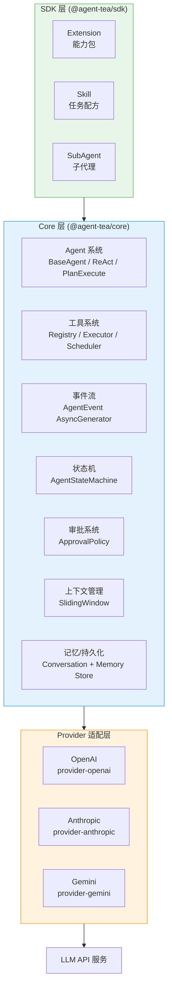

**职责分离**：

| 层      | 包名                    | 职责                                |
|---------|------------------------|-------------------------------------|
| SDK     | `@agent-tea/sdk`       | 开发者 API — Extension / Skill / SubAgent |
| Core    | `@agent-tea/core`      | Agent 循环、工具系统、事件流、状态机        |
| Provider | `@agent-tea/provider-*` | LLM 厂商适配 — 消息格式转换、流处理        |

---

## 3. 核心数据流

下图展示一次完整的 `Agent.run(input)` 调用从开始到结束的全流程：

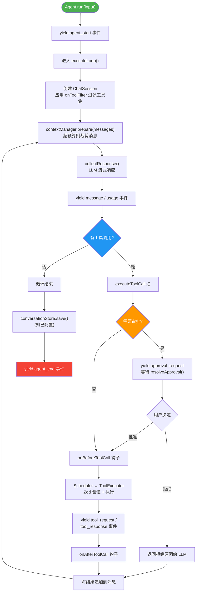

**关键观察**：

1. **整个流程是一个 AsyncGenerator** — 调用者通过 `for await` 消费事件，实现实时 UI
2. **工具执行结果追加到消息** — LLM 在下一轮看到工具的输出，决定下一步
3. **审批是非阻塞的** — yield 一个事件然后等待外部调用 `resolveApproval()`
4. **上下文裁剪在每轮 LLM 调用前** — 防止消息累积超出窗口

---

## 4. Agent 系统

### 4.1 BaseAgent 模板方法

`BaseAgent` 是所有 Agent 的抽象基类，使用**模板方法模式**提供共享基础设施：

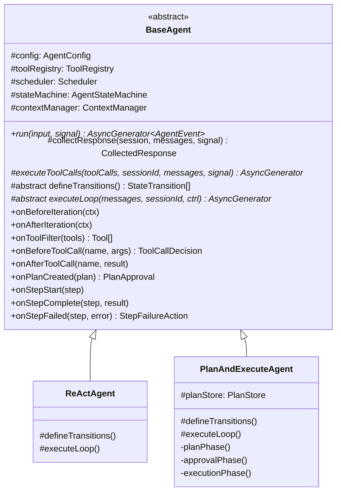

**子类契约** — 只需实现两个方法：

| 方法                | 职责                              |
|--------------------|---------------------------------|
| `defineTransitions()` | 定义该 Agent 类型的合法状态转换规则       |
| `executeLoop()`      | 实现核心循环逻辑（在 agent_start/end 之间执行）|

**钩子系统** — 无需子类化即可定制行为：

```
Agent 生命周期钩子：
├── onBeforeIteration  → 每轮开始前
├── onAfterIteration   → 每轮结束后
├── onToolFilter       → 按状态动态过滤可用工具
├── onBeforeToolCall   → 工具执行前拦截/修改
├── onAfterToolCall    → 工具执行后观察
├── onPlanCreated      → 计划审批门
├── onStepStart        → 步骤开始
├── onStepComplete     → 步骤完成
└── onStepFailed       → 步骤失败 → 返回恢复策略
```

### 4.2 ReActAgent 推理-行动循环

ReAct（Reasoning + Acting）是最基础的 Agent 策略：LLM 思考，调用工具，看结果，再思考...直到给出最终回答。

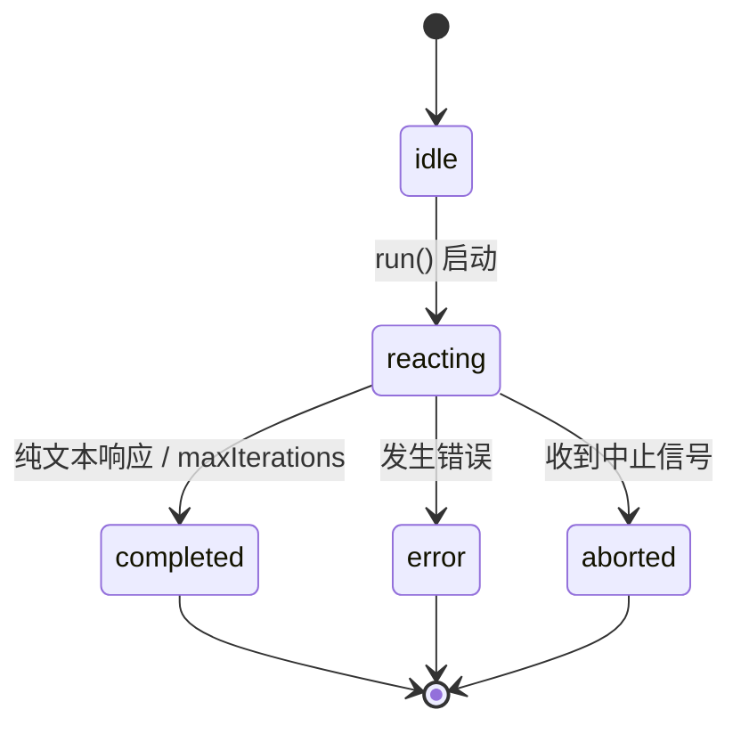

**循环逻辑**：

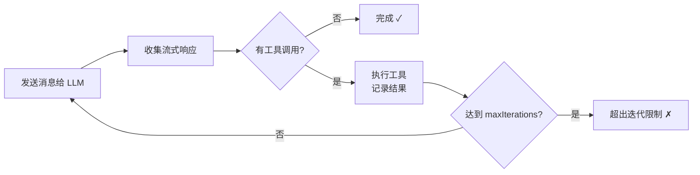

**Plan Mode 支持**：当 `allowPlanMode=true` 时，自动注入 `enter_plan_mode` 和 `exit_plan_mode` 两个内置工具，让 LLM 可以动态切换到计划模式。

### 4.3 PlanAndExecuteAgent 计划-审批-执行

适用于需要人类审批的复杂任务。三阶段工作流：

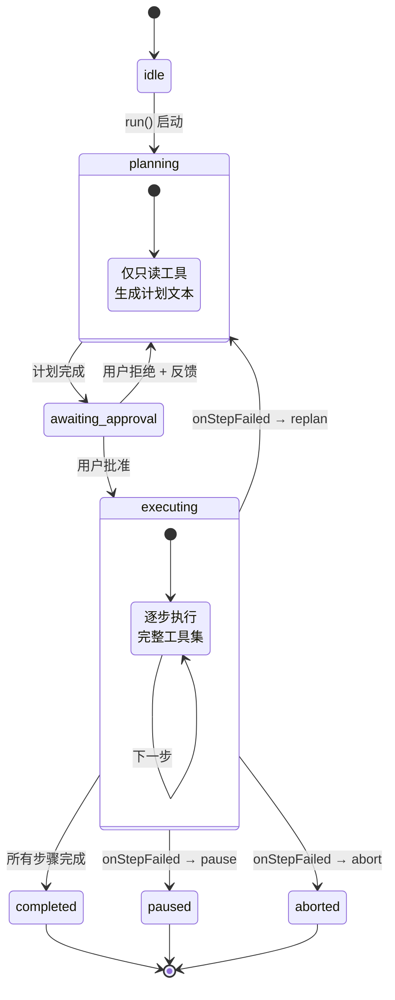

**三个阶段详解**：

| 阶段  | 可用工具     | 产出                  | 关键机制              |
|------|------------|----------------------|---------------------|
| 规划  | 仅 `readonly` 标签 | 结构化 Plan 对象       | `onToolFilter()` 过滤 |
| 审批  | 无          | 用户确认/拒绝+反馈      | `onPlanCreated()` 钩子 |
| 执行  | 全部工具     | 逐步执行结果            | 失败恢复：skip/pause/replan/abort |

**计划解析**：LLM 输出文本 → 尝试提取编号/项目符号列表 → 降级为单步计划。计划通过 `PlanStore` 持久化到 `.agent-tea/plans/` 目录。

### 4.4 状态机

`AgentStateMachine` 强制合法的状态转换，非法转换立即抛错（fail-fast）：

```typescript
// 定义
const transitions = [
  { from: 'idle', to: 'reacting' },
  { from: 'reacting', to: 'completed' },
  // ...
];

// 使用
machine.transition('reacting');  // ✓ 合法
machine.transition('completed'); // ✓ 合法
machine.transition('idle');      // ✗ 抛异常！不能从 completed 回到 idle
```

---

## 5. 工具系统

### 5.1 工具定义与注册

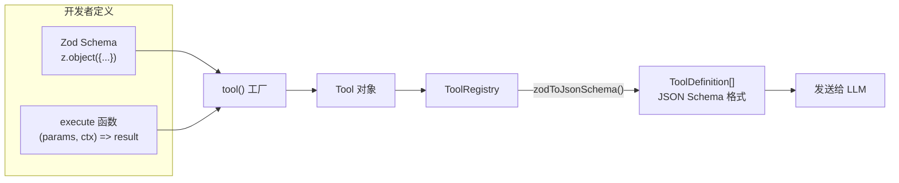

**工具接口**：

```typescript
interface Tool<TParams> {
  name: string           // 工具名称（注册时检查唯一性）
  description: string    // 给 LLM 看的描述
  parameters: ZodType    // Zod schema — 同时驱动类型推断和运行时验证
  tags?: string[]        // 标签 — 用于过滤和审批
  execute(params, ctx)   // 执行函数
}
```

**ToolContext（依赖注入）**：

```typescript
interface ToolContext {
  sessionId: string            // 会话追踪
  cwd: string                  // 当前工作目录
  messages: readonly Message[] // 对话历史（只读）
  signal: AbortSignal          // 取消信号
}
```

**ToolResult（灵活输出）**：

```typescript
interface ToolResult {
  content: string              // 发给 LLM 的文本
  displayContent?: string      // 替代显示（给 UI 用）
  data?: Record<string, unknown>  // 结构化数据
  isError?: boolean            // 错误标志 — LLM 看到后可调整策略
}
```

### 5.2 执行管线

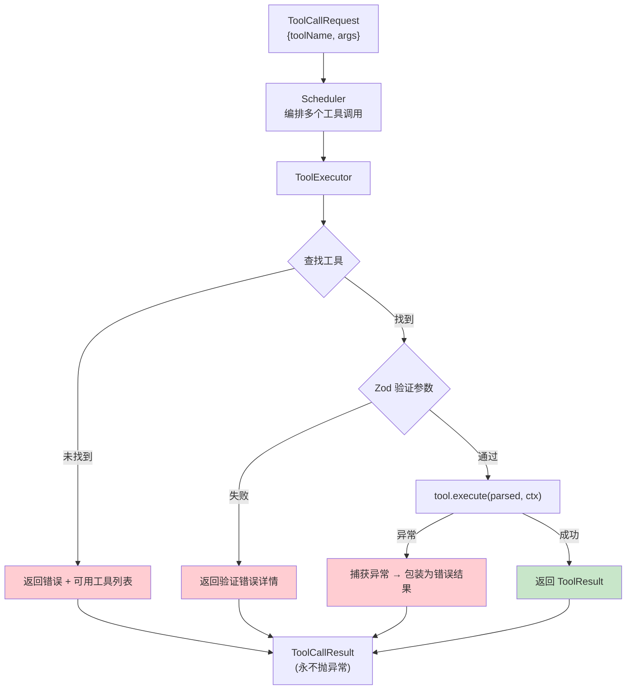

**为什么 Scheduler 和 Executor 分离？**

| 组件       | 职责                        | 扩展方向              |
|-----------|---------------------------|---------------------|
| Scheduler | 多工具编排（当前顺序执行）       | 未来可扩展为并行执行      |
| Executor  | 单工具执行（验证 + 错误处理）   | 稳定不变              |

**核心哲学**：所有错误转为结构化结果 → LLM 能看到错误信息 → 自行调整策略。Agent 循环永远安全。

---

## 6. LLM Provider 系统

### 6.1 Provider + ChatSession 工厂模式

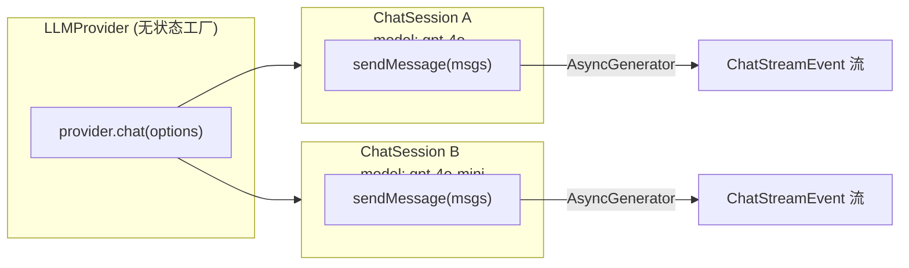

**设计要点**：

- **Provider 无状态** — 只是工厂，持有 API 客户端
- **Session 有状态** — 封装一次对话的配置（model、systemPrompt、tools）
- **一个 Provider 创建多个 Session** — 主 Agent 和 SubAgent 可共享 Provider 但用不同模型

### 6.2 消息与流事件统一模型

框架定义统一的消息和流事件类型，Provider 负责与厂商格式互转：

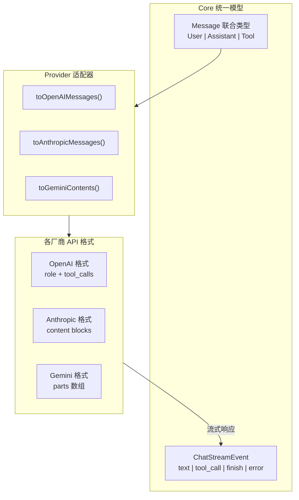

**消息类型（可辨识联合）**：

```
Message
├── UserMessage     { role: 'user',      content: string | ContentPart[] }
├── AssistantMessage { role: 'assistant', content: ContentPart[] }
└── ToolMessage     { role: 'tool',      content: ToolResultPart[] }

ContentPart
├── TextPart       { type: 'text',        text: string }
├── ToolCallPart   { type: 'tool_call',   toolCallId, toolName, args }
└── ToolResultPart { type: 'tool_result',  toolCallId, content, isError? }
```

### 6.3 三家 Provider 对比

| 维度                 | OpenAI              | Anthropic             | Gemini              |
|---------------------|---------------------|-----------------------|---------------------|
| **工具调用参数格式** | JSON 字符串          | 对象                   | 对象                |
| **工具结果位置**     | 独立 `tool` 角色消息  | `user` 消息中的 content block | `user` 内容中的 parts |
| **系统提示词**       | `system` 角色消息     | 顶级 `system` 参数     | `config.systemInstruction` |
| **流式工具调用**     | 跨 chunk 碎片化拼接   | content_block 生命周期  | 单 chunk 完整到达    |
| **max_tokens**      | 可选                 | **必填**（默认 4096）    | 可选               |
| **API Key 来源**    | 自动读环境变量        | 自动读环境变量          | 需手动传入          |
| **消息交替规则**     | 灵活                 | **严格 user/assistant 交替** | 灵活 (user/model) |
| **finish_reason**   | `tool_calls`/`stop`  | `tool_use`→`tool_calls` | 枚举/数字 映射      |

**流式处理差异示意**：

```
OpenAI 工具调用流:
  chunk1: { tool_calls[0].function.name: "calc" }
  chunk2: { tool_calls[0].function.arguments: '{"x":' }
  chunk3: { tool_calls[0].function.arguments: '1}' }
  → 需要按 index 累积拼接 → 最终解析 JSON

Anthropic 工具调用流:
  content_block_start:  { type: "tool_use", id, name }
  content_block_delta:  { partial_json: '{"x":' }
  content_block_delta:  { partial_json: '1}' }
  content_block_stop:   → 解析完整 JSON
  → 按 blockIndex 跟踪生命周期

Gemini 工具调用流:
  chunk: { functionCall: { name: "calc", args: {x: 1} } }
  → 完整到达，无需拼接
```

---

## 7. 事件系统

`Agent.run()` 返回 `AsyncGenerator<AgentEvent>`。所有事件使用 `type` 字段做可辨识联合。

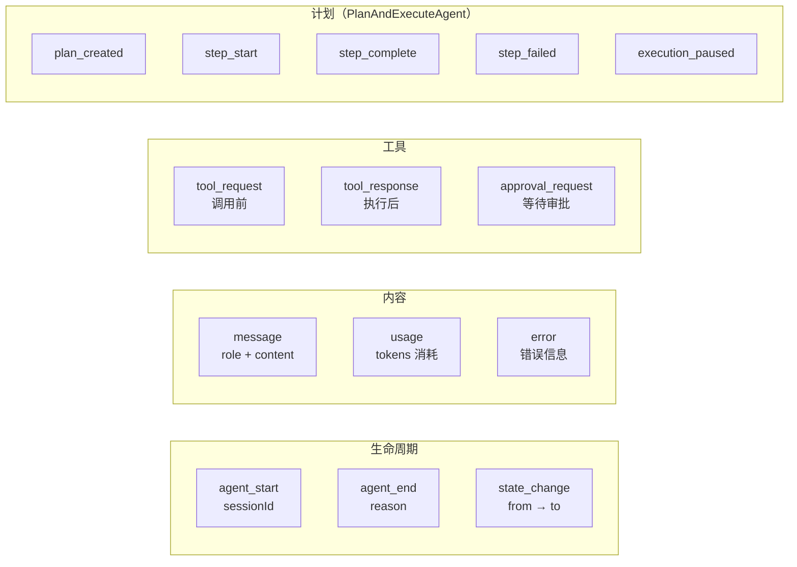

**消费者模式**：

```typescript
for await (const event of agent.run(input)) {
  switch (event.type) {
    case 'message':
      console.log(event.content);       // 实时显示
      break;
    case 'tool_request':
      console.log(`调用 ${event.toolName}...`);
      break;
    case 'approval_request':
      const ok = await askUser(event.toolName, event.args);
      agent.resolveApproval(event.requestId, { approved: ok });
      break;
    case 'usage':
      trackTokens(event.inputTokens, event.outputTokens);
      break;
    case 'agent_end':
      console.log(`完成: ${event.reason}`);
      break;
  }
}
```

---

## 8. 审批系统

基于标签的工具调用审批机制，在执行敏感操作前等待人类确认。

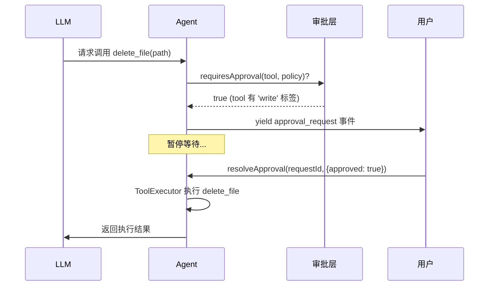

**三种审批模式**：

```
ApprovalPolicy.mode:
├── 'never'   → 全自动，不审批（测试/可信场景）
├── 'always'  → 所有工具都需审批（最高安全）
└── 'tagged'  → 仅匹配标签的工具需审批（推荐）
      └── requireApprovalTags: ['write', 'irreversible']
```

**审批决定**：

```typescript
interface ApprovalDecision {
  approved: boolean
  reason?: string                        // 拒绝原因 → 发给 LLM
  modifiedArgs?: Record<string, unknown> // 执行前修改参数
}
```

**设计亮点**：
- 审批不阻塞其他 Agent/调用
- 拒绝原因发给 LLM，它可以调整策略
- `modifiedArgs` 允许在执行前修改参数（如用户修正路径）

---

## 9. 上下文管理

解决消息累积超出 LLM 上下文窗口的问题。

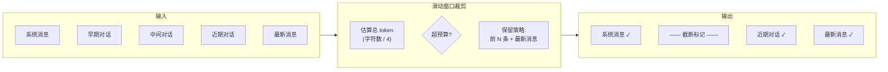

**配置**：

```typescript
contextManager: {
  maxTokens: 8000,            // token 预算
  strategy: 'sliding_window', // 当前唯一策略
  reservedMessageCount: 1     // 保留开头 N 条消息
}
```

**调用时机**：`BaseAgent.collectResponse()` 在每次发给 LLM 前自动应用。非破坏性 — 返回新数组，原始消息不变。

---

## 10. 记忆与持久化

两个独立存储层，解决不同级别的持久化需求：

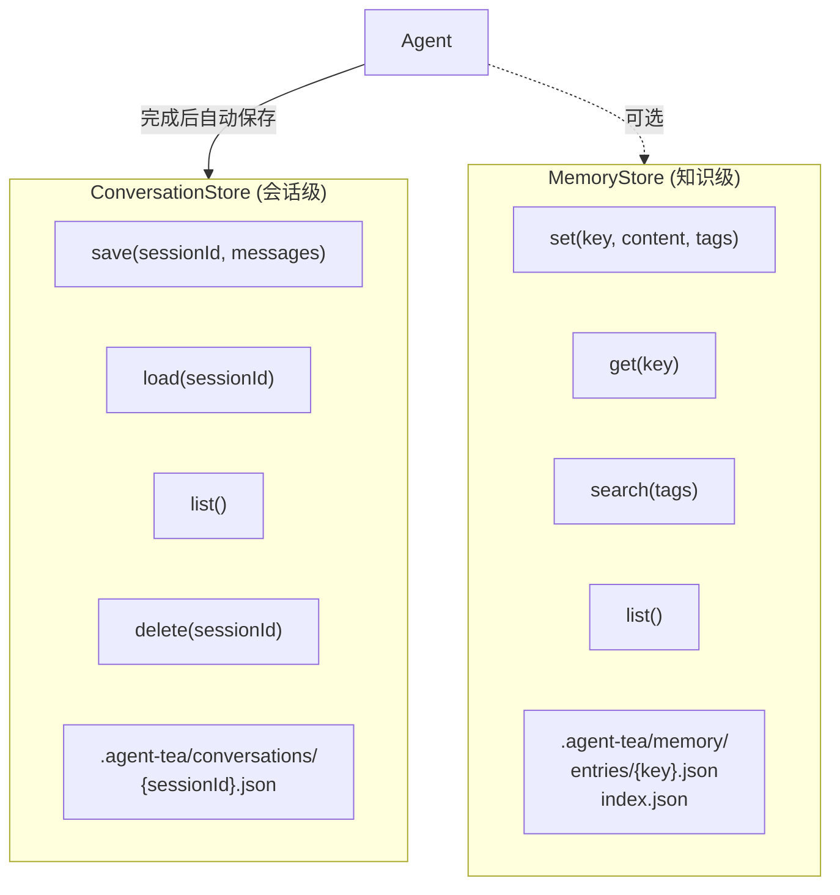

| 存储层              | 粒度    | 用途               | 实现                      |
|--------------------|--------|-------------------|--------------------------|
| ConversationStore  | 会话级  | 完整对话历史，审计/回放  | `FileConversationStore`  |
| MemoryStore        | 知识级  | 跨会话知识，标签搜索    | `FileMemoryStore` + index.json |

**都是可选的** — 不配置则无持久化行为。

---

## 11. SDK 层抽象

SDK 在 Core 之上提供面向开发者的高层抽象。

### 11.1 Extension 能力包

将工具、技能、指令打包为可复用的能力模块（类似插件）。

```typescript
const webExtension = extension({
  name: 'web-tools',
  description: 'Web 搜索和抓取能力',
  instructions: '你可以使用 web_search 和 web_fetch 工具...',
  tools: [searchTool, fetchTool],
  skills: [researchSkill],
});
```

### 11.2 Skill 任务配方

封装特定任务模式：指令 + 工具 + 触发条件。

```typescript
const codeReviewSkill = skill({
  name: 'code-review',
  description: '代码审查',
  instructions: '仔细审查代码变更，关注安全性、性能...',
  tools: [readFileTool, diffTool],
  trigger: '/review',  // 用户输入 /review 激活
});
```

### 11.3 SubAgent 子代理

**核心思想**：把一个完整的 Agent 包装成一个 Tool，实现透明的层级化委派。

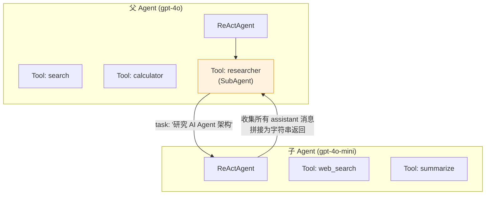

**工作原理**：

1. `subAgent()` 创建一个 `ReActAgent` 实例
2. 返回一个 `Tool`（接受 `task: string` 参数）
3. 父 Agent 像调用普通工具一样调用它
4. 子 Agent 独立运行完整的 ReAct 循环
5. 收集所有 assistant 消息，拼接为字符串返回给父 Agent

**优势**：
- 父 Agent 不需要知道子 Agent 的内部实现
- 子 Agent 可以用不同的模型（如用更便宜的模型处理简单子任务）
- 支持多级嵌套 — 子 Agent 也可以有自己的子 Agent

---

## 12. 错误处理

### 错误层级

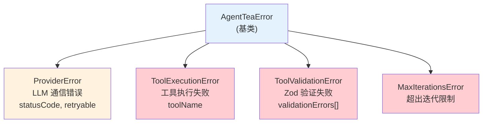

### 重试机制

```typescript
retryWithBackoff(fn, {
  maxAttempts: 3,           // 最多重试 3 次
  initialDelayMs: 1000,     // 初始延迟 1s
  maxDelayMs: 30000,        // 最大延迟 30s
  jitter: 0.3,              // ±30% 抖动防止惊群
  isRetryable: (err) => ..., // 自定义判断是否可重试
  signal: abortSignal,       // 取消支持
});
```

**退避算法**：`delay = initialDelay × 2^(attempt-1) ± jitter%`

---

## 13. 设计模式总结

| 模式            | 应用位置                     | 解决的问题                |
|----------------|---------------------------|------------------------|
| **模板方法**     | BaseAgent → 子类           | 共享基础设施，策略可替换       |
| **工厂**        | `tool()`, `LLMProvider.chat()` | 类型安全的对象创建         |
| **策略**        | ReAct vs PlanExecute       | 可切换的 Agent 行为        |
| **注册表**      | ToolRegistry               | 集中管理，名称冲突检测       |
| **依赖注入**    | ToolContext                 | 运行时环境传递，无全局状态    |
| **钩子/插件**   | `onBeforeToolCall` 等       | 无需子类化即可扩展          |
| **可辨识联合**   | Message, AgentEvent, ContentPart | 类型安全的模式匹配     |
| **AsyncGenerator** | `run()`, `ChatSession`  | 流式结果，不缓冲不阻塞       |
| **状态机**      | AgentStateMachine          | 强制合法状态转换            |
| **适配器**      | Provider toXxxMessages()   | 统一接口 ↔ 厂商格式转换     |

---

## 附录：Monorepo 结构一览

```
agent-tea/
├── packages/
│   ├── core/                     # 框架核心
│   │   └── src/
│   │       ├── agent/            # Agent 策略 + 状态机
│   │       ├── approval/         # 审批系统
│   │       ├── config/           # 配置类型
│   │       ├── context/          # 上下文管理
│   │       ├── errors/           # 错误层级 + 重试
│   │       ├── llm/              # Provider/Session 接口
│   │       ├── memory/           # 持久化层
│   │       ├── scheduler/        # 工具执行调度
│   │       └── tools/            # 工具系统 + 内置工具
│   ├── sdk/                      # 开发者 API
│   │   └── src/
│   │       ├── extension.ts      # Extension 能力包
│   │       ├── skill.ts          # Skill 任务配方
│   │       └── sub-agent.ts      # SubAgent 子代理
│   ├── provider-openai/          # OpenAI 适配器
│   ├── provider-anthropic/       # Anthropic Claude 适配器
│   └── provider-gemini/          # Google Gemini 适配器
├── examples/                     # 使用示例
│   ├── basic-agent.ts            # 基础 Agent
│   ├── sub-agent.ts              # 多 Agent 协作
│   └── approval-and-memory.ts    # 审批 + 记忆
├── docs/                         # 设计文档
└── .agent-tea/                   # 运行时产物（gitignore）
    ├── conversations/            # 会话历史
    ├── memory/                   # 知识记忆
    └── plans/                    # 计划文件
```
